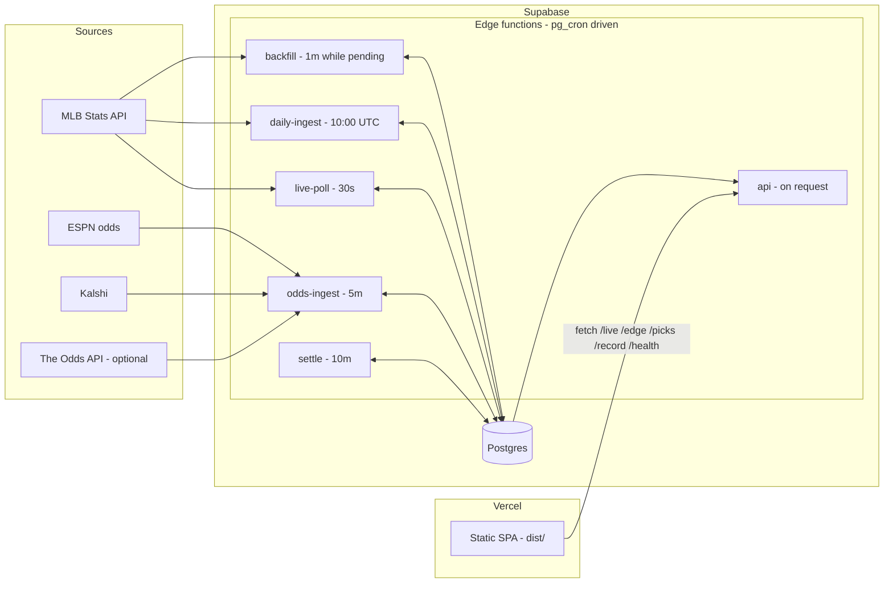
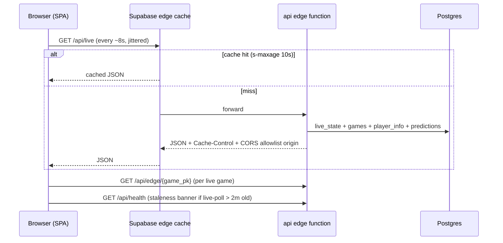
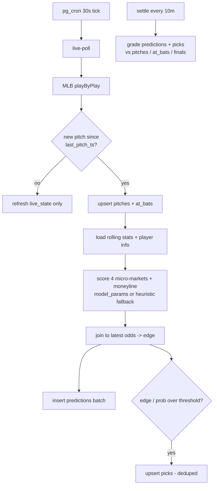
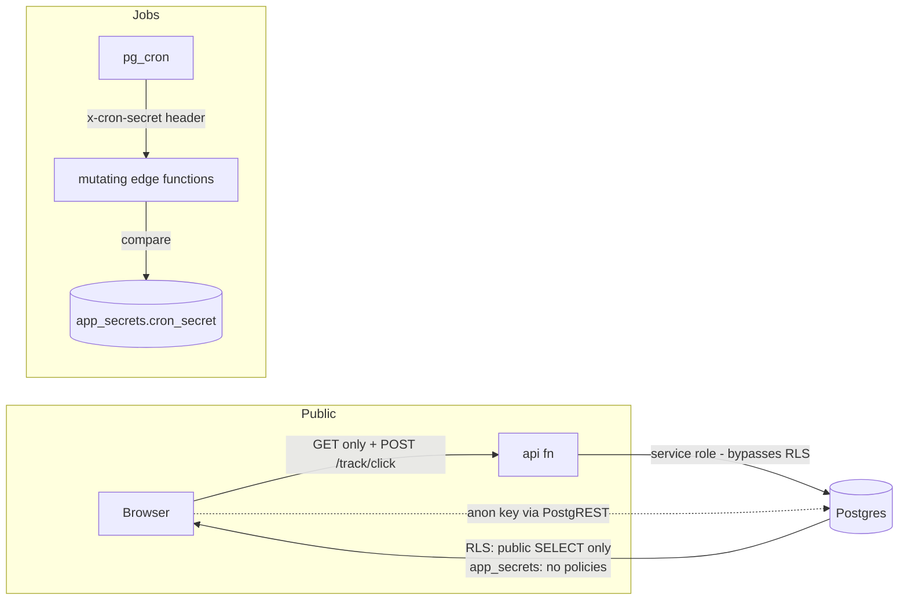
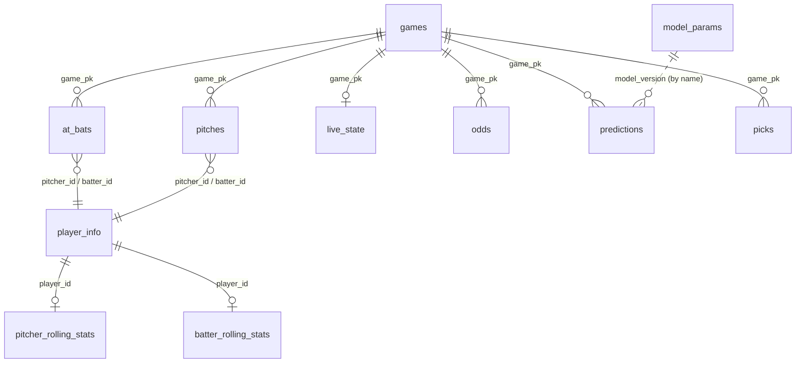

# NextPitch — live MLB at-bat analytics

NextPitch ingests all MLB data daily, polls live games in real time, scores
per-market prediction models, prices them against real odds, and tracks every
published pick — **hosted entirely on Supabase** (Postgres + edge functions +
pg_cron), with a static frontend on Vercel.

> **Positioning note.** The public frontend ships as a live *analytics* board:
> model probabilities, projections, and the pitch-by-pitch feed. All wagering
> surfaces (sportsbook source filters, edge highlighting, settled-pick tables,
> betting-compliance copy, and the `/edge` API calls) are gated behind a
> single feature flag, **off by default**. The odds/edge/picks pipeline below
> keeps running untouched; only its UI is hidden. To restore the wagering UI,
> build with `NEXTPITCH_FEATURE_WAGERING=true` (or set
> `localStorage["np-feature-wagering"]="true"` in a running browser). Details:
> [`docs/rebrand-inventory.md`](docs/rebrand-inventory.md).

- **Live site:** https://mlb-next-pitch.vercel.app
- **Live API:** `https://gfxpchtyncgsczqdvohr.supabase.co/functions/v1/api`
  (`/health` is the single-pane status check)

## Project Overview

**What it does.** During live MLB games, NextPitch predicts micro-markets on
every plate appearance — next-pitch speed, next-pitch result, at-bat outcome,
pitches in the at-bat — plus game moneylines. Predictions are joined to real
odds (ESPN consensus, Kalshi, optionally The Odds API), the model-vs-market
edge is computed, threshold-crossing picks are published, and every pick is
later graded win/loss/push against what actually happened. The record is
public and honest: model-fair micro-market picks are tagged `model_fair` so
they never read as beating a real sportsbook.

**Target users.** Demo audiences (investors), bettors evaluating the model's
read on live games, and developers extending the pipeline.

**Core features.**
- Live board: one panel per in-progress at-bat, refreshed ~30s end-to-end.
- Model-priced markets with per-source edge (line shopping across books).
- Published picks with reasoning bullets and a graded, auditable track record.
- Day-zero operation: every market degrades to a labeled league-average
  heuristic until trained models exist, then sharpens automatically.
- Model registry with atomic activate/rollback and a training quality gate.

## Tech Stack

| Layer | Technology |
|---|---|
| Frontend | Vanilla JS/CSS single-page app (no framework, no build tooling beyond one bash script) |
| Hosting (frontend) | Vercel, static output from `scripts/build_frontend.sh` → `dist/` |
| Backend (production) | Supabase Edge Functions (Deno/TypeScript) |
| Scheduling | `pg_cron` + `pg_net` inside Supabase Postgres |
| Database | Supabase Postgres (RLS: public read, service-role writes) |
| Auth | None for users (all data public-read); jobs gate on a shared `x-cron-secret`; CORS allowlist |
| External APIs | MLB Stats API, ESPN scoreboard odds, Kalshi, The Odds API (optional) |
| Models / training | Python (numpy, scikit-learn) → parameters stored as JSON in `model_params` |
| Local-dev mirror | FastAPI + asyncio poller (`backend/`) — **nothing in production depends on it** |
| CI/CD | GitHub Actions: tests + Deno typecheck + migration checks; one-click Supabase deploy; weekly training |

## Architecture

Production runs on Supabase; the frontend is a static reader.



### Request flow (a user opens the live board)



### Data flow (one live pitch)



### Auth flow

There is no user auth. Two gates protect writes:



- All app tables have RLS with a public-`SELECT` policy; `app_secrets` and
  `backfill_progress` have RLS and **no** policies (service-role only).
- Mutating functions deploy with `verify_jwt=false` and check `x-cron-secret`
  against `app_secrets.cron_secret` themselves.
- The `api` function reads `app_secrets.allowed_origins` and echoes only
  allowlisted origins in CORS (localhost always allowed for dev).
- `SECURITY DEFINER` helpers (`call_edge_function`, `pick_record`, pruning and
  registry functions) have `EXECUTE` revoked from `anon`/`authenticated`.

### Database relationships



## Folder Structure

```
├── frontend/               # static SPA (no build step; open index.html)
│   ├── index.html          #   shell: mounts #np-root, loads the scripts
│   ├── nextpitch.js        #   renders Home / Live Markets / Data Feed tabs
│   ├── nextpitch-data.js   #   sample data + edge engine + loadLive() adapter
│   ├── picks-data.js       #   sample picks/record data (not loaded by index.html)
│   ├── copy.js             #   all positioning-sensitive strings (analytics + wagering variants)
│   ├── config.js           #   injects window.PITCH_EDGE_API + feature flags at build time
│   └── nextpitch.css       #   theme tokens (light/dark), layout
├── supabase/
│   ├── functions/          # PRODUCTION backend (Deno edge functions)
│   │   ├── _shared/        #   db/http/mlb/ingest/model/vocab modules
│   │   ├── api/            #   public read API the frontend consumes
│   │   ├── live-poll/      #   30s: live state, predictions, picks
│   │   ├── odds-ingest/    #   5m: ESPN/Kalshi/The Odds API -> odds, pregame picks
│   │   ├── settle/         #   10m: grade predictions + picks
│   │   ├── daily-ingest/   #   daily: finals, slate, rolling stats, retention
│   │   └── backfill/       #   1m while pending: historical season drain
│   ├── migrations/         # schema, cron, RPCs, hardening (source of truth)
│   └── seed_demo.sql       # optional labeled demo data (source='demo')
├── backend/                # LOCAL-DEV FastAPI mirror of the same logic
│   ├── api/                #   routes (/live, /edge, /picks, /record, …)
│   ├── ingestion/          #   MLB / Savant / odds-provider clients
│   ├── models/             #   predictor + stats cache
│   ├── jobs/               #   settlement
│   └── db/                 #   legacy local schema (superseded by migrations)
├── scripts/
│   ├── build_frontend.sh   # frontend/ -> dist/ + API URL substitution (Vercel build)
│   ├── provision.sh        # one-command Supabase provisioning (CLI)
│   ├── train_models.py     # fit v1 models -> model_params (quality-gated)
│   ├── backfill.py         # local Statcast backfill (pybaseball)
│   ├── backfill_phase2.py  # rolling stats / matchups / players
│   └── verify_feeds.py     # MLB feed smoke test
├── tests/                  # pytest suite vs FakeSupabaseClient (no network)
├── docs/                   # DEPLOY.md (hosted pipeline), MODELS.md (registry)
├── .github/workflows/      # ci.yml, deploy-supabase.yml, train-models.yml
└── vercel.json             # static build config (buildCommand -> dist/)
```

Key separation: `supabase/functions/` is what runs in production;
`backend/` is a faithful local mirror for fast iteration without deploys.
The two share vocabulary contracts (`vocab.py` ↔ `vocab.ts` — keep in sync).

## Local Development

### Prerequisites

- Python 3.13 (3.11+ works)
- A Supabase project **only if** you run the local FastAPI stack or training
  (the frontend alone can use the live hosted API)

### Fastest path — frontend against the live hosted API

```bash
bash scripts/build_frontend.sh          # writes dist/ pointed at the live API
python -m http.server 5173 -d dist      # any static server works
# open http://localhost:5173
```

Opening `frontend/index.html` directly instead runs in bundled sample-data
mode (the `{{SUPABASE_FUNCTIONS_URL}}` placeholder in `config.js` is only
substituted by the build).

### Full local backend (FastAPI + live poller)

```bash
python -m venv .venv
.venv\Scripts\activate                  # Windows; source .venv/bin/activate elsewhere
pip install -r requirements.txt
pip install -r requirements-dev.txt     # tests
cp .env.example .env                    # set SUPABASE_URL + SUPABASE_KEY (service role)
```

Database setup: apply the migrations in `supabase/migrations/` to your
project **in filename order** (Supabase SQL editor, `supabase db push`, or
MCP `apply_migration`). Skip nothing — they are idempotent.

Run:

```bash
# optional: load historical Statcast data + aggregates
python scripts/backfill.py                        # default window (2025-03-27 -> yesterday)
python scripts/backfill.py 2026-04-01 2026-04-07  # custom window
python scripts/backfill_phase2.py                 # rolling stats, matchups, players

python scripts/verify_feeds.py                    # smoke-test the MLB feed

.venv\Scripts\python.exe -m uvicorn backend.api.main:app --host 127.0.0.1 --port 8080 --reload
```

Health check at `http://127.0.0.1:8080/health`, then open
`frontend/index.html` — it polls `http://localhost:8080` by default (override
with `window.PITCH_EDGE_API`; see `frontend/config.js`).

**Gotchas**
- **Single worker only.** The live store is in-memory; `WEB_CONCURRENCY > 1`
  makes `/live` stale and multiplies MLB polling (the app warns at startup).
- **Auth is off locally.** `API_KEY` unset skips the `X-API-Key` check; a
  per-IP rate limit (default 120/min) still applies. Set `API_KEY` before
  exposing the FastAPI app anywhere public.
- **Windows line endings.** `.gitattributes` forces LF on `*.sh` — don't
  override it; a CRLF `build_frontend.sh` breaks the Vercel build when
  deploying from the CLI.

### Tests

```bash
pytest                          # unit/route tests — no network, no real Supabase
pytest -m network tests/smoke   # optional: hits the real MLB Stats API
```

Route and cache tests run against `FakeSupabaseClient` (`tests/conftest.py`).
`tests/smoke/` is excluded by default (`pytest.ini`) so CI never depends on
MLB API uptime.

### Development workflow

1. Iterate on logic in `backend/` locally (fast, no deploys) or directly in
   `supabase/functions/` (typecheck with `deno check supabase/functions/*/index.ts`).
2. Mirror any behavior change across both stacks where the contract overlaps
   (`vocab`, market shapes, settlement rules).
3. `pytest` + CI (tests, Deno typecheck, migrations on a throwaway Postgres).
4. Ship edge-function changes with the **Deploy pipeline to Supabase** GitHub
   Action (idempotent) or `scripts/provision.sh`.
5. Frontend deploys automatically when master is pushed (Vercel Git
   integration).

## Production Deployment

### Supabase (the whole backend) — one-time

Fastest path is GitHub Actions (no local tooling). Add repo secrets
`SUPABASE_ACCESS_TOKEN`, `SUPABASE_PROJECT_REF`, `SUPABASE_DB_PASSWORD`, then
run **Actions → "Deploy pipeline to Supabase"**. It pushes migrations, stores
the cron secret + functions URL in `app_secrets`, deploys all six functions
(`verify_jwt=false`), and seeds the backfill. Re-run it to ship changes.
Details and the manual CLI alternative: [`docs/DEPLOY.md`](docs/DEPLOY.md).

Train models once the backfill has data (or use the **Train models** workflow,
weekly by default): `python scripts/train_models.py`. Registry operations
(activate/rollback/quality gate): [`docs/MODELS.md`](docs/MODELS.md).

### Vercel (frontend)

`vercel.json` is preconfigured: build command `bash scripts/build_frontend.sh`,
output `dist/`, no framework. Import the repo at vercel.com/new or `npx vercel
deploy`. The build defaults to this project's live Supabase functions URL —
override with the `SUPABASE_FUNCTIONS_URL` env var to target another project,
or set it empty to force sample-data demo mode.

> **Dashboard check:** the project's *Framework Preset* must be **Other**.
> If it reads "FastAPI" (auto-detected from `requirements.txt`), every build
> wastes time installing Python packages the static site never uses.

After the first deploy, lock CORS to your domain (comma-separate to add more):

```sql
insert into app_secrets (key, value) values ('allowed_origins','https://<your-app>.vercel.app')
on conflict (key) do update set value = excluded.value;
```

### Production checklist

- [ ] Migrations applied in order (`supabase/migrations/`)
- [ ] `app_secrets`: `cron_secret`, `functions_base_url`, `allowed_origins`
- [ ] All 6 edge functions deployed, `verify_jwt=false`
- [ ] Cron jobs active: `select jobname, active from cron.job;` (5 × `np-*`)
- [ ] Backfill drained: `select * from backfill_progress;` (`done = true`)
- [ ] Models active: `/health` → `active_models` lists 5 markets
- [ ] `/health` → `data_fresh: true` during a live game window
- [ ] Vercel framework preset = Other; site loads and shows live data

## Database

Schema lives in `supabase/migrations/` (idempotent, filename order = apply
order). `backend/db/schema.sql` is the legacy local-dev bootstrap; migrations
supersede it.

| table | purpose |
|---|---|
| `games` | one row per scheduled/played game (status, teams, scores, venue) |
| `pitches` | one row per pitch, historical + live; conflict key `(game_pk, at_bat_index, pitch_number)` |
| `at_bats` | one row per plate appearance with result + pitch count; conflict key `(game_pk, at_bat_index)` |
| `live_state` | one row per in-progress game (count, players, current-PA pitches in `raw_json`), PK `game_pk` |
| `player_info` | player names, handedness, position |
| `pitcher_rolling_stats` / `batter_rolling_stats` | 30-day aggregates the live scorer reads (refreshed daily via RPC) |
| `matchup_history` | career pitcher×batter PA counts |
| `game_context`, `pitcher_game_log`, `umpire_stats` | enrichment used by the local stack / future features |
| `odds` | append-only odds snapshots per (game, market, source, outcome) with `implied_prob` and de-vigged `novig_prob`; pruned to 14d keeping the last snapshot |
| `predictions` | append-only audit log of every scored market row; graded in place by `settle` |
| `picks` | curated published picks; unique `nulls not distinct (pick_date, game_pk, market, at_bat_index, recommendation)`; graded by `settle` |
| `bet_clicks` | anonymous affiliate-click funnel (public INSERT, rate-limited in the api fn) |
| `model_params` | model registry: one `is_active` row per market (partial unique index) |
| `ingest_runs` | per-job run log (ok, detail JSON); 30-day retention |
| `backfill_progress` | single-row cursor for the self-draining backfill |
| `app_secrets` | cron secret, functions URL, CORS allowlist, optional API keys — RLS with no policies |

Key RPCs: `refresh_*_rolling_stats`, `refresh_matchup_history` (daily),
`train_*_cells` (weighted training aggregates), `pick_record` (record page
aggregate), `activate_model` / `rollback_model` (registry),
`prune_ingest_runs` / `prune_odds` (retention), `call_edge_function`
(pg_cron dispatcher).

## Application Workflow

End to end for one live game:

1. **pg_cron** fires `np-live-poll` every 30s → `call_edge_function('live-poll')`
   POSTs with the `x-cron-secret` header via `pg_net`.
2. **live-poll** pulls today's schedule, and for each in-progress game pulls
   play-by-play, upserts `pitches`/`at_bats`, refreshes `live_state` (with the
   current-PA pitch list cached in `raw_json`). If nothing new happened since
   `last_pitch_ts`, it stops there.
3. On a new pitch state it loads rolling stats + player info, scores the four
   micro-markets with the active `model_params` row (or the labeled heuristic),
   joins each over/under to the freshest odds (or a model-fair line at even
   money, tagged `model_fair`), fetches MLB's live win probability for the
   moneyline, inserts a `predictions` batch, and publishes threshold-crossing
   `picks` (deduped by unique constraint).
4. **odds-ingest** (5m) snapshots ESPN/Kalshi (and The Odds API if keyed),
   de-vigs two-sided quotes into `novig_prob`, and publishes pregame log5
   moneyline picks with edge ≥ 5%.
5. **settle** (10m) grades pending `predictions` and `picks` against the next
   pitch / finished at-bat / final score, writing `result`/`status` and
   `profit_units`.
6. **The browser** polls `GET /api/live` (~8s, jittered, paused when the tab is
   hidden) and `GET /api/edge/{game_pk}`; the Home tab pulls `/sportsbooks`,
   `/picks/today`, `/record`. Responses are CDN-cached (10–60s) and
   in-instance memoized, so load scales with cache TTLs, not user count. The
   app boots on bundled sample data, swaps to live data when the API answers,
   and shows a "data delayed" banner if `/health` reports live-poll stale.

## Environment Variables

Local `.env` (copy from `.env.example`); production values live in Vercel
project settings and Supabase `app_secrets`, not files.

| name | purpose | example | required |
|---|---|---|---|
| `SUPABASE_URL` | Supabase project URL (backend stack + training) | `https://abcd.supabase.co` | for `backend/` + training |
| `SUPABASE_KEY` | service-role key (writes) or anon key (read-only training with `--emit`) | `eyJ…` | for `backend/` + training |
| `SUPABASE_FUNCTIONS_URL` | build-time API base for the frontend; unset → live project default; empty → sample mode | `https://abcd.supabase.co/functions/v1` | optional (Vercel env) |
| `API_KEY` | if set, FastAPI requires `X-API-Key` | `long-random-string` | optional |
| `RATE_LIMIT_PER_MINUTE` | per-IP limit on the FastAPI app | `120` | optional |
| `POLL_INTERVAL_SECONDS` | local live-poll cadence | `8` | optional |
| `STATS_REFRESH_SECONDS` / `ROLLING_REFRESH_SECONDS` | local cache/aggregate refresh cadence | `3600` / `1800` | optional |
| `FALLBACK_TTL_SECONDS`, `ROLLING_TTL_SECONDS`, `MATCHUP_TTL_SECONDS`, `GAME_CTX_TTL_SECONDS`, `GAME_LOG_TTL_SECONDS` | per-entity cache TTLs (`backend/config.py`) | see `.env.example` | optional |
| `ODDS_PROVIDER` | local odds provider selector | `stub` | optional |
| `THE_ODDS_API_KEY` | local reference only — production reads `app_secrets.the_odds_api_key` | `…` | optional |

Stored in **`app_secrets`** (SQL, never env): `cron_secret`,
`functions_base_url`, `allowed_origins`, `season_start`, `the_odds_api_key`.
GitHub Actions secrets: `SUPABASE_ACCESS_TOKEN`, `SUPABASE_PROJECT_REF`,
`SUPABASE_DB_PASSWORD` (deploy) and `SUPABASE_URL`, `SUPABASE_KEY` (training).

## Scripts

There are no npm scripts — this repo has no Node dependencies. The `scripts/`
directory holds everything:

| script | what it does |
|---|---|
| `bash scripts/build_frontend.sh` | copy `frontend/` → `dist/`, substitute the API URL into `config.js` (Vercel build command) |
| `bash scripts/provision.sh` | one-command Supabase provisioning: link, push migrations, store secrets, deploy functions, seed backfill (`SEED_DEMO=1` loads the demo seed) |
| `python scripts/train_models.py` | fit v1 models from the `train_*_cells` RPCs → `model_params`; `--dry-run` (never activate), `--force` (skip quality gate), `--emit <dir>` (write JSON artifacts instead of DB) |
| `python scripts/backfill.py [start end]` | local Statcast backfill via pybaseball, weekly chunks |
| `python scripts/backfill_phase2.py` | populate rolling stats, matchup history, player info (`--skip-*` flags) |
| `python scripts/verify_feeds.py` | smoke-test the MLB Stats API feed |

## Troubleshooting

| symptom | cause / fix |
|---|---|
| Vercel build fails with `set: pipefail: invalid option name` | `build_frontend.sh` reached Vercel with CRLF line endings (local `vercel deploy` from Windows). `.gitattributes` pins LF — re-checkout the file (`git checkout -- scripts/`) and redeploy. |
| Vercel build installs 65 Python packages | Project *Framework Preset* is "FastAPI". Set it to **Other** in the dashboard (harmless but slow otherwise). |
| Frontend shows sample data on the deployed site | `config.js` placeholder wasn't substituted — the site was deployed without the build step, or `SUPABASE_FUNCTIONS_URL` was set to empty. Rebuild via `scripts/build_frontend.sh`. |
| Browser CORS errors against the API | Your domain isn't in `app_secrets.allowed_origins` (comma-separated). Origins are cached ~5 min in-instance. localhost is always allowed. |
| `/health` shows `data_fresh: false` | live-poll hasn't succeeded in >2 min. Check `select * from ingest_runs order by id desc limit 20;` and the `np-live-poll` cron job. |
| `/record` is empty / zeroes | Honest: no graded picks yet. Wait for `settle` to grade, or load `supabase/seed_demo.sql` for demos (`source='demo'`, removable). |
| Local `/live` stale or duplicated polling | Running multiple workers. Use a single uvicorn worker (`WEB_CONCURRENCY=1`). |
| `SUPABASE_URL and SUPABASE_KEY must be set` | Copy `.env.example` → `.env` and fill both (service-role key for writes). |
| Cron jobs exist but functions never run | `app_secrets.functions_base_url` or `cron_secret` missing — `call_edge_function` no-ops without them. Re-run provisioning. |
| Edge function redeploy via MCP fails to resolve `_shared` imports | The MCP deploy takes a flat file list: name shared deps by their import path (e.g. `../_shared/db.ts`) and include transitive deps. |

## Future Improvements

**High priority**
- Real prop prices for the micro-markets (`pitch_speed_ou`, `ab_pitches_ou`,
  `ab_result`) — everything is wired for a per-market odds source; today they
  price model-fair at even money.
- Model v2: recalibrate `ab_result` (v1 runs hot on tails; a 0.7 shrink toward
  the league prior is applied at serving — see `_shared/model.ts` and
  `docs/MODELS.md`), add count-sequence features.
- Pin Python dependency versions (`requirements*.txt` are unpinned).

**Medium priority**
- Lower live latency below the 30s cron floor (MLB's unofficial WebSocket or a
  paid feed; would need a worker outside pg_cron).
- On-deck batter endpoint so the frontend's "Upcoming" projections stop being
  derived by perturbing the live book.
- Umpire / weather features (`game_context`, `umpire_stats` are populated by
  the local stack but unused by the hosted scorer).
- Reconcile migration version numbers between repo filenames and the live
  project's migration table (content matches; versions differ because early
  migrations were applied via MCP).

**Nice-to-have**
- Affiliate links per sportsbook (`SPORTSBOOK_AFF_*` secrets are reserved;
  `bet_clicks` funnel already records `affiliate_configured`).
- Frontend componentization if the SPA grows beyond three tabs.
- Prior-season backfill (2022–2024) for bigger training sets — extend the
  backfill window.
- Drop confirmed-unused indexes flagged by the performance advisor
  (`pitches_pitcher_idx`, `bet_clicks_book_clicked_idx`) after a season of
  traffic confirms.
