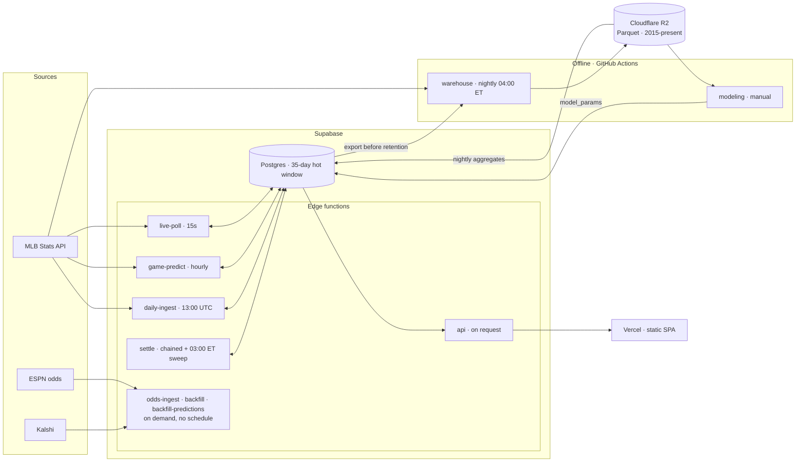

# Pitch Hawk

Live MLB at-bat analytics. During a game, Pitch Hawk scores five markets on
**every pitch** — next-pitch speed, next-pitch result, at-bat outcome, pitches
in the at-bat, and the game moneyline — then grades every call against what
actually happened and publishes the accuracy record.

- **Live site:** https://pitch-hawk.vercel.app
- **Live API:** `https://gfxpchtyncgsczqdvohr.supabase.co/functions/v1/api`
  (`/health` is the one-call status check)

The whole backend is Supabase — Postgres, edge functions and `pg_cron`, no
servers. Models are fitted offline in Python against a 7.9M-pitch Parquet
warehouse on Cloudflare R2, and served in TypeScript.

> **Positioning.** The public site is an *analytics* board. The odds/edge/picks
> pipeline still runs, but its UI is behind one flag, off by default. Build with
> `PITCHHAWK_FEATURE_WAGERING=true`, or set
> `localStorage["ph-feature-wagering"]="true"` in a running browser, to restore
> it — details in [`docs/FRONTEND.md`](docs/FRONTEND.md).

<!-- SCREENSHOT: capture the Home and Live Feed tabs during a live game window.
     The board is live-data-only, so a capture taken off-hours or against an
     unreachable API shows an empty state, not the product. See docs/DEPLOY.md. -->

---

## The parts worth reading

If you only look at four things, look at these.

**Per-pitch scoring that reconstructs what the poller missed.**
`pg_cron` fires every 15 seconds; pitches arrive every 15–20. Writing one
prediction per poll silently dropped any pitch that shared an interval with
another. A prediction is a call made *into* a position — `pitch_number = k`
means "k pitches thrown, here is the call on the next one" — so missed
positions are recoverable from the play-by-play, which stores balls/strikes
*post*-pitch. Every unscored position in the current at-bat is now scored, not
just the one the poll landed on.
→ `supabase/functions/_shared/livepitch.ts`

**A promotion gate that can see overfitting.**
The retired trainer gated on *in-sample* log-loss, which cannot see
overfitting at all: a version that memorised its training cells scored better
and promoted. Now it is walk-forward over ten folds, 2020 excluded from the
aggregate (a 60-game COVID season distorts it), 2026 held out frozen and scored
once after the sweep has already picked a winner. `linear` markets also face a
σ-coverage veto — a mis-scaled sigma has good RMSE and produces confidently
wrong probabilities, which RMSE alone cannot see. Every run is recorded,
rejected ones included: a registry holding only winners cannot show that a
version was *chosen* rather than merely produced.
→ `docs/MODELS.md`

**Offline and production scoring, pinned to each other.**
Models are fitted in Python and served by TypeScript. `modeling/score.py`
mirrors `_shared/model.ts` and is pinned to it at `1e-9` against golden
fixtures the TypeScript itself emits. Without that, "validated offline" and
"computed in production" are two unverified claims.
→ `tests/modeling/test_parity.py`, `supabase/functions/tests/scorer_golden_test.ts`

**A warehouse on a token that cannot list its own bucket.**
The R2 token is scoped read/write with **no LIST permission** — `aws s3 ls`
reports the bucket empty, and it is not. Every read resolves keys through
`_manifest.json`, which also gates the retention prune: a day earns deletion
only once it has been independently verified.
→ `docs/DATA-PIPELINE.md` §5

---

## Architecture


```mermaid
flowchart LR
    subgraph Sources
        MLB[MLB Stats API]
        ESPN[ESPN odds]
        KAL[Kalshi]
    end
    subgraph Supabase
        subgraph EF[Edge functions]
            LP[live-poll · 15s]
            GP[game-predict · hourly]
            DI[daily-ingest · 13:00 UTC]
            ST[settle · chained + 03:00 ET sweep]
            API[api · on request]
            OTH[odds-ingest · backfill · backfill-predictions<br/>on demand, no schedule]
        end
        PG[(Postgres · 35-day hot window)]
    end
    subgraph Offline[Offline · GitHub Actions]
        WH[warehouse · nightly 04:00 ET]
        ML[modeling · manual]
    end
    R2[(Cloudflare R2<br/>Parquet · 2015-present)]
    FE[Vercel · static SPA]

    MLB --> LP & GP & DI
    ESPN & KAL --> OTH
    LP & GP & DI & ST <--> PG
    PG --> API --> FE
    MLB --> WH --> R2
    PG -->|export before retention| WH
    R2 --> ML -->|model_params| PG
    R2 -->|nightly aggregates| PG
```

Five `pg_cron` jobs run today: `np-live-poll` (15s), `np-game-predict`
(hourly), `np-daily-ingest` (13:00 UTC), `np-settle-sweep` (03:00 ET gate) and
`np-prune-cron-history`. `settle` is chained directly from `live-poll` whenever
a game advanced, so a result is graded in ~15s rather than on a timer; the
sweep is the catch-all for anything a failed chain left behind.

`odds-ingest`, `backfill` and `backfill-predictions` are deployed but
unscheduled — they run on demand. Verify the live state rather than trusting
this paragraph:

```sql
select jobname, schedule, active from cron.job order by jobname;
```

---

## The model lifecycle

```bash
python -m modeling build                  # R2 -> local feature-cell cache
python -m modeling baseline               # score the live version, comparably
python -m modeling sweep pitch_result     # walk-forward over the grid
python -m modeling train pitch_result     # sweep + holdout + record a run
python -m modeling train pitch_result --promote   # + gate + activate
python -m modeling status                 # registry vs what live scoring stamps
python -m modeling rollback pitch_result  # undo, atomically
```

**CI records, humans promote.** The training workflow is `workflow_dispatch`
only and never passes `--promote`: a run there writes a `model_runs` row and
changes nothing about what production serves. **There is no `--force`** — the
old trainer had one and it existed to skip the gate.

`status` compares the registry's active version against what live scoring
actually stamped on `predictions.model_version`, so a forgotten `live-poll`
redeploy shows up as a mismatch instead of a mystery.

Full detail — gate rules, `params` shapes per model type, how to add a market:
[`docs/MODELS.md`](docs/MODELS.md).

---

## Repo layout

```
supabase/functions/   PRODUCTION backend (Deno/TypeScript), 8 functions
  _shared/              db · http · mlb · model · livepitch · pitchfeed · vocab · aggregates
  api/                  the public read API the frontend consumes
  live-poll/            15s: pitches, per-position scoring, picks, chains settle
  game-predict/         pregame moneyline + totals, frozen once set
  daily-ingest/         finals, slate, rolling stats, retention
  settle/               grades predictions and picks
  odds-ingest/ backfill/ backfill-predictions/    on demand
  migrations/           schema, cron, RPCs, hardening — the source of truth

modeling/             offline ML workbench: build → sweep → train → gate → promote
  specs/                one file per market; the engine never branches on market name
  score.py              Python mirror of model.ts, parity-pinned

warehouse/            R2 Parquet lake: ingest · verify · export · publish aggregates
dashboard/            Streamlit QA dashboard over the warehouse + model runs
frontend/             static SPA, no framework, no build tooling beyond one bash script
tests/                pytest — modeling, warehouse, dashboard
scripts/              build_frontend.sh · provision.sh · warehouse_backfill.py
.github/workflows/    ci · deploy-supabase · train-models · warehouse (nightly)
```

`supabase/functions/` is what runs in production. `modeling/` and `warehouse/`
are offline and cannot affect what users see until a human promotes a model.

---

## Running it

**Frontend against the live API** — the fastest way to see it work:

```bash
bash scripts/build_frontend.sh     # writes dist/ pointed at the live API
python -m http.server 5173 -d dist
```

The board is live-data-only. With no reachable API it reports that it cannot
reach the feed; there is no offline demo mode.

**Tests:**

```bash
pip install -r requirements-warehouse.txt -r requirements-modeling.txt pytest
pytest                                              # 217 tests, no network
deno test --allow-net --allow-read --allow-env supabase/functions/tests/
```

**The modeling workbench** and **the dashboard** need R2 credentials — copy
`.env.example` to `.env` and fill in `SUPABASE_*` and `R2_*`:

```bash
pip install -r requirements-modeling.txt && python -m modeling build
pip install -r dashboard/requirements.txt && streamlit run dashboard/app.py
```

---

## Docs

| doc | what it is |
|---|---|
| [`docs/MODELS.md`](docs/MODELS.md) | the model registry: gate, promotion, rollback, `params` shapes |
| [`docs/DATA-PIPELINE.md`](docs/DATA-PIPELINE.md) | how the two ingest paths differ, the warehouse schema, the manifest, invariants |
| [`docs/DATA-OPERATIONS.md`](docs/DATA-OPERATIONS.md) | every scheduled job, why each is shaped the way it is, and the runbooks |
| [`docs/DEPLOY.md`](docs/DEPLOY.md) | provisioning and deploying the whole pipeline |
| [`docs/DATABASE.md`](docs/DATABASE.md) | table-by-table reference and retention policy |
| [`docs/FRONTEND.md`](docs/FRONTEND.md) | the SPA, the build, and the wagering feature flag |
| [`docs/design-tokens.md`](docs/design-tokens.md) | frontend design system |
| [`dashboard/README.md`](dashboard/README.md) | the QA dashboard and how its thresholds were calibrated |

**One rule these docs try to keep:** a number a command can print belongs in a
runbook as *the command*, not in prose. Prose figures rot — three docs once
quoted three different day counts for the same manifest.

---

## Known gaps

- **Micro-market prices are model-fair.** `pitch_speed_ou`, `ab_pitches_ou` and
  `ab_result` have no real prop source, so they price at even money and are
  tagged `model_fair` — they never read as beating a sportsbook.
- **`game_moneyline` is fitted but not served.** `model.ts` has no `log5`
  branch; `game-predict` takes the function's default `homeAdv = 0.542`. The
  workbench measures it at ~0.535, so the number is at least known rather than
  an unexamined constant. Do not `--promote` it.
- **`game_total` is scored but unregistered** — a sixth market with no
  `model_params` row and no `modeling/specs/` module.
- **Latency floors at the cron tick.** Sub-15s needs a worker outside
  `pg_cron`.
- **Python dependencies are unpinned.**
- **`pitches.outs` violates its own range on ~22% of rows** — an open ingest
  bug, see `dashboard/README.md`.
