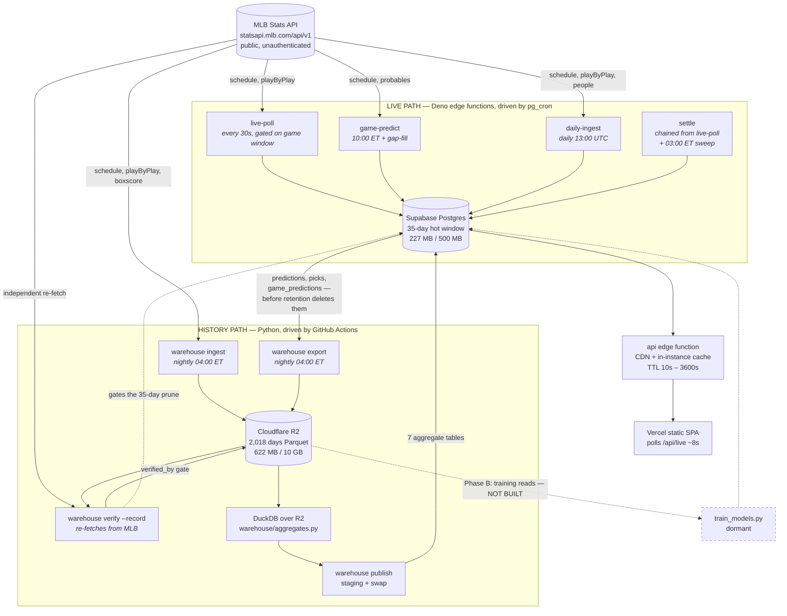
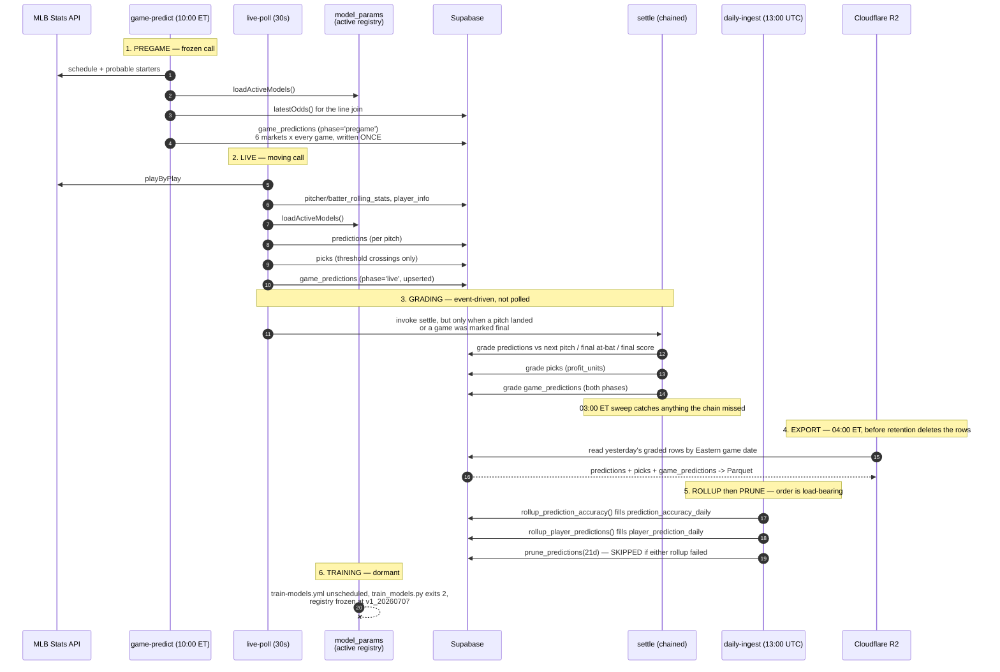

# Pitch Hawk — Data Operations

**Audience:** whoever is on the hook when a pipeline stops.
**Scope:** every automated data call in the system — what triggers it, how often
it fires, what it writes, whether it is currently working, and what happens when
it isn't. From `statsapi.mlb.com` through Supabase Postgres and Cloudflare R2 to
the served frontend.
**As of:** 2026-08-07, 23:50 UTC. Every figure below was measured on that date
through the live system; §9 gives the exact command for each so you can
re-measure rather than trust this file.

**Companion documents.** [`DATA-PIPELINE.md`](DATA-PIPELINE.md) is the *design*
document — semantics, invariants, rationale, rejected alternatives. This file is
the *operations* view. Where the two disagree about current state, **this file
wins**; where they disagree about why something is built the way it is,
`DATA-PIPELINE.md` wins.

---

## 1. The one-paragraph version

Two independent readers pull from the same public MLB Stats API. The **live
path** (Deno edge functions, driven by pg_cron) keeps a 35-day hot window in
Supabase Postgres current to within 30 seconds and scores predictions against
it. The **history path** (Python, driven by a GitHub Actions nightly) writes
11 seasons of wide Parquet into Cloudflare R2, verifies it against a re-fetch,
then computes display aggregates in DuckDB over R2 and publishes them back into
Supabase. Vercel serves a static SPA that reads one edge function and holds no
data of its own. As of today all four live schedulers are firing, R2 is current
through yesterday, the database sits at 227 MB of its 500 MB cap, and **one job
— `daily-ingest` — is failing** (§8.1).

---

## 2. Every automated call, in one table

Four different schedulers drive this system. Knowing which one owns a given job
is the first thing to establish when something stops.

### 2.1 pg_cron — inside Supabase Postgres

Jobs dispatch through `call_edge_function()` (`SECURITY DEFINER`, `pg_net`,
`x-cron-secret` header). **Trust `cron.job`, not the migrations** — schedules
have been changed in production after the migration that created them.

> **Rescheduled 2026-08-08** (`20260808000001_eastern_schedules.sql`). Pregame
> scoring moved to a single 10:00 ET run, grading became event-driven, and the
> 10-minute settle timer was retired. Rows below marked ⟳ are the new shape.

**All Eastern-time jobs run hourly and return immediately unless the local hour
matches.** pg_cron evaluates schedules in UTC and has no per-job timezone, so a
literal `0 14 * * *` is 10:00 in New York only between March and November. The
hourly tick is one cheap `exists`; the gate is
`now() at time zone 'America/New_York'`, which is correct across both DST
transitions with nobody re-cutting the cron in November.

| Job | Cadence | Fires | Conditional gate | Writes | Last observed |
|---|---|---|---|---|---|
| `np-live-poll` | **every 30 s** | `live-poll` | only if a game is inside `[start_ts, start_ts+4h)` **or** a `live_state` row is still `status='live'` | `pitches`, `at_bats`, `live_state`, `predictions`, `picks`, `game_predictions` (`phase='live'`) | ✅ 2,002 ok / 0 failed in 48 h |
| ⟳ `np-game-predict` | **10:00 ET**, then hourly gap-fill | `game-predict` | at 10:00, any unstarted game today; after 10:00, **only** if an unstarted game is missing pregame markets | `game_predictions` (`phase='pregame'`) | ✅ 43 ok / 0 failed in 48 h |
| ⟳ `np-settle-sweep` | **03:00 ET** | `settle` | local hour = 3 | grades whatever the live chain missed, ahead of the 04:00 export | new |
| ~~`np-settle`~~ | ~~every 10 min~~ | — | **retired** — `live-poll` now chains `settle` directly (§5.3) | — | — |
| `np-daily-ingest` | **daily 13:00 UTC** | `daily-ingest` | none | re-ingest of finals, slate upsert, rolling stats, rollups, retention prunes | ❌ **failed 2026-08-07** (§8.1) |
| `np-prune-cron-history` | **daily 13:15 UTC** | `prune_cron_history(7)` (SQL, no edge fn) | none | trims `cron.job_run_details` | ✅ |

Two edge functions are deployed and callable but have **no `cron.job` row at
all** — deliberately unscheduled, not broken:

- **`odds-ingest`** — the only caller of the trained log5 moneyline model. Its
  absence is why `odds` holds 178 stale rows and why every served moneyline is
  stamped `mlb_winprob_v1` (MLB's own feed) rather than our model.
- **`backfill`** — drained and retired. `backfill_progress` reads `done=true`.

### 2.2 GitHub Actions

| Workflow | Trigger | What it does | Health |
|---|---|---|---|
| ⟳ `warehouse.yml` | **04:00 ET** — `0 8 * * *` **and** `0 9 * * *`, both guarded | `guard` picks today's real 04:00 line; `ingest`: `status` → `pending --max-gap 14` → per day `ingest` then `verify --record`; `export`: yesterday's model output → R2; `publish`: DuckDB aggregates → Supabase | ✅ 4 of last 5 green |
| `ci.yml` | every push + every PR | pytest; `deno check` + `deno test` on the edge functions; all migrations applied to a stock PG16 with `cron`/`pg_net` stubbed | ✅ green on `master` |
| `deploy-supabase.yml` | `workflow_dispatch` **only** | link → `db push` → rotate `cron_secret` → deploy all 7 edge functions | ⚠️ 4 consecutive failures 2026-08-06 (all from a non-default branch; `schedule`/`dispatch` only run from `master`) |
| `train-models.yml` | `workflow_dispatch` **only** | fits v1 models → `model_params` | ⏸ **dormant by design** — schedule removed 2026-08-02; `train_models.py` exits 2 (§7.5) |

### 2.3 Vercel — git-push, not cron

Project `pitch-hawk` (`prj_pmfGlZlMUOWZylkKsAHrGB2R11sF`). Every deployment is
triggered by a GitHub push; there are no Vercel cron jobs and no Vercel
functions. `vercel.json` builds `scripts/build_frontend.sh` → `dist` as a static
SPA. Last production deployment is `READY` on `a200477` (PR #23).

**Vercel is not part of the ingestion pipeline.** It holds no data and makes no
upstream calls. It is a consumer, reaching Supabase through the single `api`
edge function. A total Vercel outage costs the website; it costs no data.

### 2.4 Manual / on-demand

`python -m warehouse {status,pending,ingest,verify,backfill,publish}`,
`scripts/warehouse_backfill.py`, and the two `workflow_dispatch` workflows.
None of these run unattended.

---

## 3. System flow

Every solid edge below exists and ran today.



The only dashed edge left is training. Everything else is live.

---

## 4. The 24-hour clock

Times are **Eastern**, because that is now the anchor for every job except
`daily-ingest`. UTC equivalents are given in parentheses for EDT (in-season).

```mermaid
gantt
    title One day of automated data calls, America/New_York
    dateFormat HH:mm
    axisFormat %H:%M

    section Overnight batch
    settle sweep — the pre-export guarantee  :milestone, sw, 03:00, 0m
    warehouse ingest + verify                :wi, 04:00, 25m
    export predictions to R2                 :crit, ex, 04:25, 8m
    publish aggregates to Supabase           :wp, 04:25, 14m

    section Morning
    daily-ingest — 13-00 UTC                 :milestone, di, 09:00, 0m
    prune cron history                       :milestone, pc, 09:15, 0m
    game-predict — main pregame run          :crit, gp, 10:00, 15m
    game-predict — hourly gap-fill only      :gf, 10:15, 585m

    section Game time
    live-poll — every 30s                    :active, lp, 19:00, 360m
    settle — chained, within 30s of a result :active, st, 19:00, 360m
```



**The 03:00 → 04:00 ordering is the one that matters.** The export copies
*graded* rows, so the settle sweep has to have finished first. One hour of
margin, and the export overwrites by default so a row graded later still
reaches R2 on a subsequent run.

**GitHub's scheduler is late, and the workflow is built for it.** Measured
starts across five nights ran **56 minutes to 2h29m** after the nominal time
(14:56, 16:02, 16:08, 16:14, 16:29 against a `0 14` cron). The 04:00 bars above
are therefore nominal — the real ingest often begins after 05:00 ET. This is
why the DST guard branches on `github.event.schedule` (which cron line fired)
rather than on the wall clock: an hour-equality check would skip the entire
night whenever the queue was busy. Nothing downstream cares about the delay,
because ingest only writes final games and the export overwrites.

---

## 5. Per-pipeline detail

### 5.1 `live-poll` — 30 seconds

**Trigger.** pg_cron `np-live-poll`, but the job body is a `do $$` block that
calls the edge function **only** if a game is inside `[start_ts, start_ts + 4h)`
or a `live_state` row still reads `live`. Off-hours the cron entry fires and does
nothing, which is why 2,002 successful runs in 48 hours is the correct number
rather than 5,760.

**The second condition is load-bearing.** A game running past four hours keeps
polling because `live_state` says it is live, and `live-poll`'s own stale-cleanup
is what eventually marks it final — which closes the loop. Without it, extra-inning
games would freeze mid-board.

**Per cycle:** pull today's schedule; for each in-progress game pull
`playByPlay`; if nothing changed since `last_pitch_ts`, refresh `live_state` and
stop. On a new pitch: upsert `pitches`/`at_bats`, refresh `live_state` (current-PA
pitch list cached in `raw_json`), load rolling stats and `player_info`, score four
micro-markets plus the moneyline with the active `model_params` row, insert a
`predictions` batch, upsert the `phase='live'` `game_predictions` row, and publish
threshold-crossing `picks` (`AB_PICK_MIN_PROB = 0.52`, `ML_PICK_EDGE = 0.04`).

**Failure mode.** Logs to `ingest_runs`, returns 200 with an error list. A failed
cycle is cheap — the next cycle re-polls full game state, so nothing is lost. This
is why pausing it for four minutes during the Phase 3 swap cost nothing.

### 5.2 `game-predict` — 10:00 ET, then gap-fill only

**New as of 2026-08-06** (PR #23, edge function version 1, migration
`20260806020310_cron_game_predict.sql`). Not described in any older document.

**The problem it solves.** `live-poll` was the only writer of predictions, and
pg_cron gates it to `[start_ts, start_ts + 4h)`. A user loading the site in the
morning saw an empty board, because nothing had been computed yet. Coverage went
from **0 of 11 games pregame-complete on 2026-08-05 to 15 of 15 on 2026-08-07**
(§7.2).

**Per cycle:** resolve today's slate, skip anything matching `NOT_SCOREABLE`
(started, final, postponed, cancelled, suspended), then for each remaining game
score all six markets. Both probable starters are scored against a league-average
batter and the two distributions averaged — scoring only the home starter would
report a number for half the game.

**Pregame rows are written once and never updated.** That is deliberate: the
frozen row is the model's honest pre-game call and the only one that can be
fairly graded as a track record. In-game movement lives in the `phase='live'`
row.

**Schedule, as of 2026-08-08.** The main run is 10:00 ET. Every later hour
re-runs **only** if a game that has still not started is missing pregame
markets. Previously this fired unconditionally at :05 of every hour, which was
self-healing but wasteful — because the rows are frozen, 13 of every 14 runs
wrote nothing.

The gap-fill branch is not optional dressing. Pregame coverage is the metric
this function exists to move (0/15 games before it shipped, 15/15 after), and a
single daily run has two ways to lose it: the 10:00 run fails, or a probable
starter is announced after it. The gate counts distinct `phase='pregame'`
markets per game against the expected six, straight off `game_predictions`
(~3k rows) rather than through `prediction_coverage_daily`, whose raw-market
fallback aggregates all ~250k rows of `predictions` and is far too heavy to run
hourly.

### 5.3 `settle` — chained from `live-poll`, plus a 03:00 ET sweep

Grades three things against real outcomes: `predictions` (against the next pitch,
the finished at-bat, or the final score), `picks` (with profit in units, using
`winProfit` on American odds), and — new with PR #23 — `game_predictions` rows of
both phases. Batch size 400. Mirrors the documented rules in
`backend/jobs/settle_predictions.py`.

**Trigger, as of 2026-08-08.** The `np-settle` 10-minute timer is retired.
`live-poll` now calls `settle` itself via `invokeFunction()` in `_shared/db.ts`,
at the end of any cycle that either ingested new pitches or marked a game
final. A result is graded within ~30 seconds of landing instead of up to ten
minutes later.

Two details that make this safe rather than merely faster:

- **The final-game branch is a separate trigger, not an afterthought.** When
  the last game leaves the board, `live-poll` takes the `!liveGames.length`
  path, marks stale `live_state` rows final, and returns — and pg_cron then
  stops calling it entirely. Game-level markets (moneyline, totals) only become
  gradable at exactly that moment. Without chaining settle from *that* branch,
  every game-level prediction would sit ungraded until the next morning.
- **Chained failures are non-fatal and never block ingest.** `invokeFunction`
  returns errors rather than throwing, on a 20-second timeout. A failed chain
  costs grading latency, not a dropped pitch.

The cron secret is read fresh on every call and deliberately not cached:
`deploy-supabase.yml` rotates it on every deploy, and a warm instance holding
the old value would send 403s to a perfectly healthy function.

`np-settle-sweep` at 03:00 ET is the backstop and, more importantly, the
guarantee the 04:00 export depends on — a row exported ungraded is a row the
holdout set can never score.

### 5.4 `daily-ingest` — daily 13:00 UTC

The heaviest single job, and the one currently failing. Six stages, and **the
ordering between stages 4 and 5 is a correctness constraint, not a preference**:

1. Re-ingest finals for `T-2` and `T-1` (two days, to catch late finishes).
2. Upsert today's and tomorrow's slate.
3. `ensurePlayers` for anyone seen in the last two days of `at_bats`.
4. `refresh_pitcher_rolling_stats` / `refresh_batter_rolling_stats` — both look
   back 30 days, inside the 35-day hot window.
5. **Rollups before prunes.** `rollup_prediction_accuracy` writes the permanent
   accuracy record; `rollup_player_predictions` derives per-player history —
   `predictions` carries no player id, so joining `at_bats` at this moment is the
   *only* chance to derive it before the raw rows are deleted.
6. Retention: `ingest_runs` 7 d, `odds` 14 d, `predictions` 21 d,
   `game_predictions` 35 d, `player_prediction_daily` 90 d. **`prune_predictions`
   is skipped if either rollup failed** — a bad rollup must not be allowed to
   silently destroy predictions we have no aggregate for.

`refresh_matchup_history` was called here until 2026-08-02 and was dropped: it
read `at_bats` unwindowed and upserted over career head-to-head counts, so
against a 35-day `at_bats` it would have overwritten career history with 35-day
figures within hours of the swap. `matchup_history` is now rebuilt from the
warehouse instead.

**Observed runtime** 10–30 s on success. Today it hit 30 s and failed at stage 5
(§8.1).

### 5.5 Warehouse nightly — `warehouse.yml`, 04:00 ET nominal

Four jobs: `guard` → `ingest` → (`export`, `publish`). `publish` is gated on
`needs: ingest` succeeding, because publishing aggregates built from a day that
failed verification would put unverified numbers on the site.

**`export` is sequenced after `ingest` but NOT gated on it**, and the
distinction is deliberate. They are unrelated datasets from unrelated sources:
a day whose games are not all final blocks the MLB ingest and has no bearing on
whether our own predictions can be copied out. Coupling them would let one
delayed West Coast game quietly stop the holdout set accumulating — the exact
"every day of delay is a day of evaluation data permanently lost" problem the
export exists to end. The ordering that *is* required is manifest safety: both
jobs do a load-modify-save on one JSON object and must not overlap.

**The DST guard branches on which cron line fired, not on the wall clock.**
GitHub cron is UTC-only, so 04:00 ET needs two lines (`0 8` for EDT, `0 9` for
EST) with one of them discarded each day. The obvious guard — compare the
current Eastern hour to 04 — would have been a bug: this scheduler runs
56 minutes to 2h29m late, so a busy queue would skip the whole night. Instead
the guard reads `github.event.schedule`, the literal cron expression that
triggered the run, and compares it against what `TZ=America/New_York date +%z`
says the correct line is. A run that starts at 06:12 ET still knows it was the
04:00 line.

**Job `ingest`** (timeout 45 min, `concurrency: cancel-in-progress: false` — never
two writers on one manifest):

1. `python -m warehouse status` — doubles as the credential check. `R2Store`
   probes the bucket at construction and raises on a wrong name, rather than
   reporting an empty manifest the way a mistyped `R2_BUCKET` silently did until
   2026-08-02.
2. `python -m warehouse pending --max-gap 14` → `days.txt`. Exits 2 if the whole
   catch-up window is missing, which means a deliberate backfill is needed rather
   than a nightly.
3. Per day: `ingest --day` then **`verify --day --record`**. `--record` is the
   point of the job — without it the day is stored but never earns the prune's
   delete gate.
4. `status` again, `if: always()`.

**Job `publish`:** builds seven aggregate tables in DuckDB over R2 and publishes
each via clear-staging → batched insert → `publish_aggregate()` in one plpgsql
transaction. A failure leaves the previous night's aggregates serving rather than
a half-written table, and a zero-row publish is refused outright.

**Measured run history:**

| Date (UTC) | Result | Duration | Note |
|---|---|---|---|
| 2026-08-03 16:29 | ✅ | 13m34s | |
| 2026-08-04 16:14 | ✅ | 12m23s | |
| 2026-08-05 16:02 | ✅ | 14m04s | |
| 2026-08-06 16:08 | ❌ | 15m03s | *"The job was not acquired by Runner of type hosted"* — GitHub infrastructure. Our code never ran; `publish` correctly did not run either. |
| 2026-08-07 14:56 | ✅ | 38m42s | **Caught up two days unattended.** |

That last row is the design working. A whole night was lost to a GitHub
infrastructure fault, nobody intervened, and the next night's
`pending --max-gap 14` found both missing days and processed them. The long
duration is the catch-up, not a regression.

### 5.6 `warehouse export` — the holdout capture, 04:00 ET

**New 2026-08-08.** Copies yesterday's `predictions`, `picks` and
`game_predictions` out of Supabase into R2 Parquet before the retention timers
reach them — 21 days for `predictions`, 35 for `game_predictions`. Until this
existed, every graded prediction older than three weeks was simply deleted,
which is why no holdout validation exists anywhere in this project.

| | |
|---|---|
| **Command** | `python -m warehouse export [--day D \| --range A..B] [--skip-existing]` |
| **Keys** | `<dataset>/season=YYYY/month=MM/day=YYYY-MM-DD.parquet` — same Hive layout as the MLB datasets, so DuckDB can join a prediction onto the pitch it was made against |
| **Measured** | 2026-08-06: 10,904 predictions, 824 picks, 121 game_predictions → **293 KB** total. ~50 MB per season against a 10 GB tier |

Three properties worth knowing:

**The day is the Eastern game date, not a UTC timestamp date.** `predictions`
carries no date column at all, so it is scoped by joining `games.official_date`
via `game_pk`. Slicing `created_at` instead would be wrong in a way that is easy
to miss: measured on the 2026-08-06 export, rows run to 23:58 ET, which is
03:58 **UTC on 2026-08-07**. `official_date` is denormalised onto each row so
the file stands alone once Supabase has pruned `games`.

**These days are recorded as ingested and can never be verified, by design.**
`warehouse.verify` earns a verification by re-fetching from the MLB API and
re-deriving from scratch. There is no upstream to re-fetch model output from, so
any check could only compare the export against itself — the exact
self-certification that made the v1 manifest worthless. `EXPORT_DATASETS` is
therefore a separate tuple from `DATASETS`, `verify` never walks it, and the
prune's delete gate only ever asks about `pitches`.
`test_export_datasets_are_never_verifiable` locks this in.

**It overwrites by default.** Unlike an MLB day, which is immutable once its
games are final, an exported day legitimately changes: a suspended game
finishes the next afternoon and its rows grade then. Re-running is how those
late grades reach R2, so the nightly must not pass `--skip-existing` — that
flag exists for bulk backfills only.

> **Not migrated:** `scripts/export_predictions.py` was a one-time cold dump
> and its output is still in the bucket under `holdout/predictions/` (present
> from 2026-07-07). It is outside the manifest and uses a different, locally
> declared schema — no `official_date`, and rows dated by `created_at`. The
> script is marked superseded but the data has deliberately not been folded in;
> unioning two different column lists silently would be worse than leaving it
> visible.

### 5.7 Serving the day: one shared state for every user

**New 2026-08-08.** The design goal is that predictions are made and graded
entirely in the background, and a visitor simply *loads* the current state —
nothing starts happening because someone opened the page, and two people
looking at the same moment see the same thing.

Most of that was already true. `/api/live` returns the **whole day's slate**
(`games where official_date = today`), not just games in progress, with the
frozen `phase='pregame'` markets standing in until first pitch and the
`phase='live'` row superseding them after. It is served from Postgres through a
CDN-cached edge function, so it is identical for everyone.

**One surface was not.** The Data Feed's per-pitch graded table was built in
the browser: `trackGradedLog()` walked each `/live` poll, graded the pitches
that arrived, and pushed them onto an array capped at 400 entries. The
consequences were all the same bug wearing different clothes —

| Symptom | Cause |
|---|---|
| Two users saw different tables at the same moment | Each accumulated only what its own tab observed |
| A refresh emptied it | The array was never persisted |
| Opening at 21:00 showed nothing from the 13:00 games | Those pitches were never observed by that session |
| It only ever held 400 rows | Hard cap, oldest discarded |

None of this was a data problem. The server had made and graded every one of
those predictions hours earlier — **nothing served them**.

`GET /api/pitches` does. Handler in `_shared/pitchfeed.ts`, TTL 15 s.

| Param | Meaning |
|---|---|
| `date` | Eastern game date, default today |
| `game_pk` | one game; must be on that date, else empty |
| `market` | comma-separated, validated against the known markets |
| `status` | `graded` drops rows still pending |
| `cursor`, `limit` | paginated, default 200, hard max 1000 |

Three things it does that the client cannot:

- **Resolves the day through `games.official_date`.** `predictions` has no date
  column, and slicing `created_at` would misfile every late-evening row — rows
  measured on 2026-08-06 run to 23:58 ET, which is the next day in UTC.
- **Computes the signed miss server-side**, so every client renders the same
  number rather than each deriving its own.
- **Carries the situation the prediction was made *into*.** Supabase stores
  balls/strikes post-pitch, so the count comes from the pitch at
  `pitch_number`, while what was actually thrown next comes from
  `pitch_number + 1`. Getting those two rows the wrong way round would
  misreport the model against itself, so a test pins it.

`predictions` also gained `actual_value` / `actual_label`
(`20260808000002`). `settle` already computed the actual for every market while
grading and threw it away; it now stores it. That is what lets the feed render
"called 94.2, actual 93.1, +1.1" from the table alone — and it puts actuals
into the R2 holdout export, which otherwise carried predictions with nothing to
score them against.

> **Rows graded before that migration have null actuals** and no backfill is
> possible beyond the 35-day `pitches` window. The read path renders null as
> "—", never as 0.0: a fabricated zero would read as a perfect prediction.

### 5.8 CI and deploy

`ci.yml` runs on every push and PR. Its three jobs are worth knowing because two
of them exist as scar tissue:

- **`backend`** installs `requirements-warehouse.txt` alongside
  `requirements.txt`. Without it, `config.py`, `ingest.py`, `manifest.py` and
  `verify.py` are unimportable and silently uncovered — which is how the manifest
  self-certification defect survived to 2026-08-02.
- **`edge-functions`** runs `deno check` on all six functions plus
  `deno test supabase/functions/tests/`. The aggregate read handlers ship in the
  edge function, so pytest cannot reach them; `backend/` is a parallel dev
  implementation that does not serve production.
- **`migrations`** applies every migration to a stock PG16 with `cron.schedule`
  and `cron.job` stubbed, rather than skipping the files that touch pg_cron —
  skipping them would silently drop their schema changes from coverage.

`deploy-supabase.yml` is dispatch-only and idempotent. Note it **rotates
`cron_secret` on every run**, so a deploy while jobs are in flight will 401 the
next cycle or two. Edge function versions confirm the last successful deploy:
`api` v12, `live-poll` v6, `daily-ingest` v6, `settle` v3, `game-predict` v1, all
updated 2026-08-06.

---

## 6. Where the model process inserts

There are **five** distinct points where the model touches data, on three
different clocks. This is the part nothing else documents.



**The registry.** All five markets are stamped `v1_20260707` and `is_active=true`.
Nothing has been trained since **2026-07-07 — one month ago**. This is not a
silent failure: the weekly schedule was deliberately removed on 2026-08-02
because the `train_*_cells` RPCs the trainer read were dropped by migration
`20260802000002` (they read all of `pitches`, and against a 35-day hot window
they would have quietly returned 35 days and produced a worse model without
saying so). `train_models.py` now exits 2 with an explanation. Re-pointing
training at DuckDB over R2 is Phase B and is the last unbuilt piece.

**A caveat that survives from `DATA-PIPELINE.md` §8 and still holds:** the
`game_moneyline` numbers you see served are MLB's own win-probability feed
(`mlb_winprob_v1`), not our trained log5 model. The trained model is only called
by `odds-ingest`, which is unscheduled.

---

## 7. Status scorecard

Measured 2026-08-07. Every verdict cites its evidence.

### 7.1 Pipelines

| Pipeline | Status | Evidence |
|---|---|---|
| `live-poll` | 🟢 | 2,002 ok / 0 failed in 48 h; last run 23:46:16, 10 s before a `/api/health` check that reported `data_fresh: true` |
| `game-predict` | 🟢 | 43 ok / 0 failed since first deploy; last 23:05:00 |
| `settle` | 🟢 | 289 ok / 0 failed in 48 h; last 23:40:00 |
| `daily-ingest` | 🔴 | **failed 2026-08-07 13:00** on `rollup_player: canceling statement due to statement timeout` (§8.1) |
| Warehouse nightly | 🟡 | 4 of last 5 green; one infrastructure failure absorbed automatically. Amber only for the missing alert and the schedule drift (§8.3, §8.4) |
| R2 warehouse | 🟢 | current through **2026-08-06** (yesterday), 2,018 days, manifest v2 |
| R2 verification | 🟡 | **286 days verified, 1,732 ingested-only** (§8.5) |
| Aggregate publish | 🟢 | all 7 tables refreshed 2026-08-07 15:34–15:35; `/api/health` reports `aggregates_stale: false` |
| Capacity | 🟢 | **227 MB / 500 MB.** The 2026-08-02 hot-window swap took it 456 MB → 182 MB (`3b75761`); it peaked at 495 MB before Phase 0 |
| Model registry | 🔴 | `v1_20260707` across all 5 markets — 31 days stale (§8.6) |
| Vercel | 🟢 | last production deploy `READY` on `a200477` |
| CI | 🟢 | green on `master` |

### 7.2 The measurable win from PR #23

`prediction_coverage()` counts games carrying all six markets. `pregame_full`
counts games that had all six **before first pitch** — the number that decides
whether a morning visitor sees a board or a blank page.

| Date | Games | Full coverage | **Pregame-full** | Avg markets |
|---|---:|---:|---:|---:|
| 2026-08-02 | 15 | 0 | **0** | 5.00 |
| 2026-08-03 | 8 | 0 | **0** | 5.00 |
| 2026-08-04 | 15 | 0 | **0** | 5.00 |
| 2026-08-05 | 15 | 0 | **0** | 5.00 |
| **2026-08-06** | 11 | 11 | **11** | 6.00 |
| **2026-08-07** | 15 | 15 | **15** | 6.00 |

A clean step change on the day `game-predict` shipped. The sixth market
(`game_total`) had never been predicted at all before this.

### 7.3 Storage position

| Store | Used | Cap | Headroom |
|---|---:|---:|---|
| Supabase Postgres | **227 MB** | 500 MB | 273 MB |
| Cloudflare R2 | **622 MB** | 10 GB free | ~94% |

Largest Postgres tables: `predictions` 84 MB, `pitches` 36 MB, `picks` 13 MB,
`matchup_history` 13 MB, `game_context` 9.6 MB, `at_bats` 7.4 MB.

**`predictions` is now the largest table in the database**, which is a reversal
worth internalising — for the whole prior history of this project, `pitches` was.
It is also the table whose prune is currently blocked (§8.1).

### 7.4 Serving layer

The `api` edge function strips `/api/` and switches on the remainder. Every
response is CDN-cached *and* memoised in-instance, so load scales with TTL, not
with user count.

| Route | TTL (s) |
|---|---:|
| `/health`, `/`, `/live` | 10 |
| `/edge/{game_pk}` | 15 |
| `/odds/today` | 30 |
| `/picks/today`, `/record`, `/games`, `/board`, `/feed` | 60 |
| `/pitches` | 15 |
| `/player/{id}/{profile,splits,fatigue}`, `/matchup/{p}/{b}`, `/coverage` | 300 |
| `/game/{pk}/context`, `/sportsbooks` | 3600 |

The 300 s tier is deliberately conservative for tables rebuilt once nightly — it
bounds staleness after a publish without making the cache pointless.

---

## 8. Areas of improvement, ranked

Ranked by consequence if ignored, not by effort.

### 8.1 🔴 `daily-ingest` is failing, and the failure ratchets

**Symptom.** 2026-08-07 13:00 UTC:
`rollup_player: canceling statement due to statement timeout`.

**Root cause, located precisely.** The `authenticator` role carries
`statement_timeout=8s` (`select rolname, rolconfig from pg_roles`). Every RPC
`daily-ingest` calls goes through PostgREST under that role, so **8 seconds is a
hard ceiling on any single rollup or prune, regardless of how long the edge
function itself is allowed to run.** `rollup_player_predictions(7)` joins seven
days of `predictions` to `at_bats`, `cross join lateral`-expands every row into a
pitcher row and a batter row, then groups and upserts. It fit inside 8 s on
2026-08-06 (returned 14,060) and did not on 2026-08-07 (15-game slate).

**The interlock worked.** `daily-ingest/index.ts` skips `prune_predictions` when
either rollup fails, rather than deleting rows it has no aggregate for. That is
correct and should not be changed.

**But it creates a ratchet.** Rollup times out → prune is skipped → `predictions`
grows → the rollup's input grows → it times out again. `predictions` is already
the largest table at 84 MB, and 3,880 rows are past the 21-day policy and
unpruned. This does not self-heal; each day makes the next day worse.

**Proposed fix**, either:
- move `rollup_player_predictions` to its own pg_cron job, which runs as
  `postgres` and is not subject to the 8 s `authenticator` cap; or
- make it single-day incremental (`p_days => 1`) instead of re-aggregating a
  rolling 7-day window every night. The `on conflict … do update` key already
  supports this; only the volume changes.

The first is more robust; the second is a one-line change to the call site.
Neither is large. Do this first.

### 8.2 🔴 `/api/health` reports `"status":"ok"` while a job is failing

`/api/health` returns `"status":"ok"`, `"data_fresh":true` and a `jobs` block —
but the block covers `live-poll`, `settle` and `game-predict` only. **The one job
that is actually broken is not in it.** Anything monitoring this endpoint, human
or machine, would have concluded the pipeline was healthy today.

`daily-ingest` runs once a day, so it needs a different staleness threshold than
a 30-second poller — probably "last success within 26 hours". The nightly
warehouse job deserves the same treatment via aggregate freshness, which is
already computed and already exposed in the same payload.

> **Two knock-on effects of the 2026-08-08 reschedule, neither breaking:**
>
> - `health()` reads the **200 most recent `ingest_runs` rows** to find each
>   job's last success. `game-predict` now writes 1–2 rows a day instead of
>   ~20, so on a busy slate it will fall outside that window and simply vanish
>   from the `jobs` block. It is not failing; it is out of frame. Fixing §8.2
>   properly means a per-job `max(finished_at)` query rather than a slice of
>   recent rows.
> - Chained settle logs a run per new-pitch cycle rather than 144 a day, so
>   `ingest_runs` roughly doubles in volume during game hours. It is on 7-day
>   retention and the table is 4 MB, so this is a note, not a risk — but it is
>   the same table §8.1's prune failure already touches.

### 8.3 🟠 Nothing alerts on any failure

Both of this week's failures — the 2026-08-06 nightly and today's `daily-ingest`
— were found by deliberate inspection during this assessment. The nightly's own
header comment says *"a nightly nobody reads a signal from is exactly how R2 came
to be three days stale without anyone noticing"*, and that reasoning applies to
the signal itself, not just to the job. A red GitHub run and a red `ingest_runs`
row are both signals nobody receives.

Cheapest useful version: a failure notification on `warehouse.yml`, plus fixing
§8.2 so an external uptime check on `/api/health` catches the pg_cron side.

### 8.4 🟠 Schedule drift is unmodelled

The nightly is documented and commented as running "after `np-daily-ingest` at
13:00 UTC". Measured starts are 56 minutes to 2h29m after the nominal 14:00. The
intended ordering has held every night so far, but by luck rather than by
construction.

The consequence of a reversal is mild — the nightly would publish aggregates
built from a warehouse missing yesterday, and the next night would correct it —
but the comment currently asserts a guarantee the scheduler does not provide.
Either widen the nominal gap, or state in the workflow that ordering is
best-effort and the job is safe under reversal.

### 8.5 🟡 1,732 of 2,018 R2 days are ingested-only

`warehouse status` says so plainly, and it is *correct*, not a bug: Phase 1
independently verified the delete set, not all of history. But nothing schedules
the remediation, and the number will simply sit there.

This matters because `verified_at`/`verified_by` is what the prune's delete gate
requires, and `is_verified()` cannot be satisfied by an ingest however complete
it looks. Any future prune of older R2 days is blocked on work nobody has
queued. A slow background sweep — a few hundred days per weekend run, exit codes
respected — would close it without hammering the MLB API.

### 8.6 🟡 The model registry is a month stale and nothing says so

All five markets read `v1_20260707`. The dormancy is deliberate and well
documented in the workflow file, but **no operational surface reports it**.
`/api/health` lists `active_models` with their versions and no age judgement, so
a stale registry looks identical to a fresh one.

This compounds a known methodological gap: there is still no holdout validation
anywhere in the project.

> **Half resolved 2026-08-08.** The *capture* half shipped — the nightly
> `warehouse export` (§5.6) now writes graded `predictions`, `picks` and
> `game_predictions` to R2 daily, so out-of-sample data has stopped being
> destroyed. What remains is the *use*: nothing reads those files, no holdout
> metric is computed, and the registry age is still unreported. Re-pointing
> training at DuckDB over R2 (Phase B) is the gate on the rest.

### 8.7 🔵 Minor — database advisors

Seven `*_staging` tables have no primary key, and `game_predictions` carries two
unused indexes (`game_predictions_home_pitcher_idx`,
`game_predictions_away_pitcher_idx`). Both are INFO-level. The staging tables are
truncated and refilled nightly and never queried by key, so the missing PKs are
arguably correct; the unused indexes are new enough that "never used" may just
mean "two days old". Recheck the indexes in a fortnight before dropping them.

### 8.8 Suggested order

1. §8.1 — the only finding that degrades on its own.
2. §8.2 + §8.3 — so the next failure is reported rather than discovered.
3. ~~§8.6's `holdout_predictions` export~~ — **done 2026-08-08** (§5.6).
4. §8.4, §8.5 — hygiene.
5. Phase B: re-point training at DuckDB over R2. Now that the export is
   accumulating, this is what turns it from stored bytes into a holdout metric.

---

## 9. Runbooks — how every number above was measured

These are the exact commands used for this assessment.

**pg_cron schedules — the source of truth, not the migrations:**
```sql
select jobname, schedule, active, command from cron.job order by jobname;
```

**Job health over the last 48 hours:**
```sql
select job,
       count(*) filter (where ok)     as ok,
       count(*) filter (where not ok) as failed,
       max(started_at)                as last_run
from ingest_runs
where started_at > now() - interval '48 hours'
group by 1 order by 1;
```

**Why a job failed** — `detail` carries the error list and the per-stage counts:
```sql
select id, started_at, ok, detail
from ingest_runs where job = 'daily-ingest' order by id desc limit 5;
```

**Capacity and table sizes:**
```sql
select relname, pg_size_pretty(pg_total_relation_size(c.oid)) as size
from pg_class c join pg_namespace n on n.oid = c.relnamespace
where n.nspname = 'public' and c.relkind = 'r'
order by pg_total_relation_size(c.oid) desc limit 20;

select pg_size_pretty(pg_database_size(current_database()));
```

**Aggregate freshness:**
```sql
select 'pitcher_profiles' t, max(updated_at) u, count(*) n from pitcher_profiles
union all select 'situational_splits', max(updated_at), count(*) from situational_splits
union all select 'matchup_history',    max(updated_at), count(*) from matchup_history;
```

**Prediction coverage — did the board have content before first pitch:**
```sql
select * from prediction_coverage(current_date - 5, current_date)
order by official_date desc;
```

**The 8-second ceiling behind §8.1:**
```sql
select rolname, rolconfig from pg_roles
where rolname in ('authenticator', 'service_role', 'anon', 'postgres');
```

**R2 warehouse — currency, row counts, verification split:**
```bash
py -m warehouse status
```
> Use `py` (system Python 3.13), not `.venv` — `.venv` holds only `pyarrow`.
> `warehouse` additionally needs `boto3`, `duckdb` and `python-dotenv` from
> `requirements-warehouse.txt`.

**Re-export a day of model output** (safe to re-run; overwrites by design):
```bash
py -m warehouse export --day 2026-08-06
py -m warehouse export --range 2026-07-20..2026-08-06 --skip-existing
py -m warehouse --local ./tmp export --day 2026-08-06   # no R2, dry run
```

**Read an exported day back:**
```sql
select result, count(*)
from read_parquet('s3://pitch-hawk-warehouse/predictions/season=2026/month=08/day=*.parquet')
group by 1;
```

**GitHub Actions history:**
```bash
gh run list --limit 30
gh run view <run-id>              # annotations explain infrastructure failures
```

**Live serving health:**
```bash
curl -s https://gfxpchtyncgsczqdvohr.supabase.co/functions/v1/api/health
```

**Vercel:**
```bash
vercel ls                          # or the Vercel MCP: list_projects / list_deployments
```

---

## 10. What is still not built

| Missing | Consequence of leaving it |
|---|---|
| **Phase B** — training reads R2 via DuckDB | The model registry stays frozen at `v1_20260707`. `train-models.yml` cannot be re-armed until this lands. |
| ~~**`holdout_predictions`** — daily export of graded `predictions` to R2~~ | **Shipped 2026-08-08** as `warehouse export` (§5.6), covering `predictions`, `picks` and `game_predictions`. Data is now accumulating; **nothing reads it yet**, which is Phase B. |
| **`market_baselines`** | Published accuracy numbers have no honest denominator. A 52.5% at-bat-result rate reads as a win rather than as +6.1 points over always guessing the most common outcome. |
| The model-facing cell tables (`context_cells`, `pitch_sequence_cells`, `fatigue_cells`, `pitch_arsenal`) | The two sub-baseline markets stay unexplained. Deferred deliberately — see `DATA-PIPELINE.md` §11. |

The frontend-facing half of the original proposal shipped: seven display
aggregates are live, published nightly, and served. The model-facing half did
not, and Phase B is the gate on all of it.
