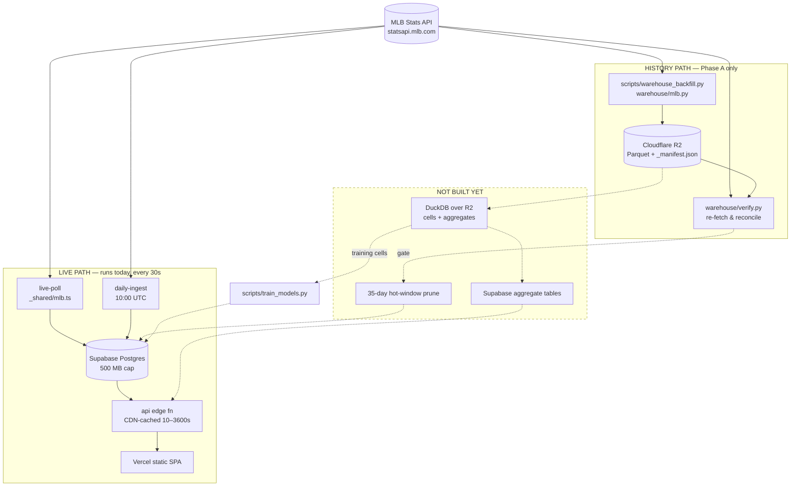

# Pitch Hawk — Data Pipeline

**Audience:** Part 1 is for data systems engineers joining the project.
Part 2 is a set of proposals for leadership.
**Scope:** every path data takes, from the MLB Stats API through the Supabase
serving layer and the Cloudflare R2 historical warehouse.
**As of:** 2026-08-02. Numbers marked *(measured)* were re-checked on that date
against the live systems; everything else cites its source.

Companion documents: [`DATA-INVENTORY.md`](DATA-INVENTORY.md) (product view of
what we hold), [`MODELS.md`](MODELS.md) (model registry runbook),
[`DEPLOY.md`](DEPLOY.md) (provisioning), and the design archive under
`docs/superpowers/`. Where those disagree with this file, see
[§1.3 What supersedes what](#13-what-supersedes-what).

---

# Part 1 — For new data systems engineers

## 1. Orientation

### 1.1 Three systems, one sentence each

| System | Role | Owner of |
|---|---|---|
| **MLB Stats API** (`statsapi.mlb.com/api/v1`) | The only upstream source. Public, unauthenticated, rate-limited under load. | Nothing — we own no data here. |
| **Supabase Postgres** (`gfxpchtyncgsczqdvohr`, `us-east-2`, PG 17.6) | The live system. Ingests today's games every 30 s, scores predictions, serves the website. Hard **500 MB** cap on the free tier. | Everything the frontend reads. |
| **Cloudflare R2** (bucket `pitch-hawk-warehouse`) | The historical warehouse. 11 seasons of Parquet, ingested independently from the MLB API. 10 GB free, **zero egress**. | The long-history training and analytics corpus. |

Vercel hosts a static SPA that reads one Supabase edge function. It holds no
data and is not part of the pipeline.

### 1.2 You are here

The warehouse was designed as a five-phase migration. **Phase A shipped; B, C
and D have not started.** This is the single most important orientation fact:

| Phase | Deliverable | Status |
|---|---|---|
| **A** | History ingested into R2, verified, nothing deleted | ✅ Shipped 2026-07-30 (`adda1d7`), verify pass `3c8f3db` |
| **B** | Training reads R2 via DuckDB instead of Postgres RPCs | ❌ Not started |
| **C** | Nightly aggregates computed in DuckDB, published to Supabase | ❌ Not started |
| **D** | 35-day hot window in Postgres; ~307 MB reclaimed | ❌ Not started |

Consequences you must internalise before touching anything:

- **Postgres still holds full 2025–26 history.** 1,213,819 pitches and 313,294
  at-bats *(measured)*. Nothing has been pruned. R2 is currently **additive**,
  not a replacement.
- ~~**There is no nightly warehouse job.**~~ **Shipped 2026-08-02**
  (Phase 2). `.github/workflows/warehouse.yml` ingests and verifies daily at
  14:00 UTC. R2 was frozen at 2026-07-30; the gap was closed by hand and
  `max(day)` now tracks yesterday. Note that a **scheduled workflow only runs
  from the default branch** — the nightly does not fire until this is merged
  to `master`.
- **Nothing reads R2 yet.** No production code path queries the warehouse. It
  is a verified, complete, currently-unused asset.

### 1.3 What supersedes what

| Document | Trust it for | Do not trust it for |
|---|---|---|
| **This file** | Current state of all three systems | — |
| `README.md` | Supabase pipeline, edge functions, deploy, local dev | It predates R2 and does not mention the warehouse |
| `DATA-INVENTORY.md` | Product framing, model win rates | Storage figures and the "cannot build" list — three of five items are now unblocked (§6.4). Its batter-coverage open question is **answered** in §6.6 |
| `docs/superpowers/specs/2026-07-29-data-pipeline-design.md` | Design rationale, rejected alternatives, the prune mechanics in §5.5 | §5.1's "export from Supabase" — revised by its own §4a |
| `docs/superpowers/plans/2026-07-29-warehouse-and-capacity.md` | Phases B, C, D task detail | **Tasks 1–7 are superseded.** The file says so at line 84 |

---

## 2. System map



Solid edges exist. Dashed edges are designed and unbuilt.

---

## 3. Ingestion — two independent readers of the same API

This is the concept that confuses everyone. **There are two separate ingest
implementations reading the same upstream, and they deliberately disagree.**

| | Live ingest | Warehouse ingest |
|---|---|---|
| Code | `supabase/functions/_shared/mlb.ts` (Deno/TS) | `warehouse/mlb.py` (Python) |
| Driver | `live-poll` edge fn, pg_cron 30 s | `scripts/warehouse_backfill.py`, manual |
| Destination | Supabase `pitches` / `at_bats` | R2 Parquet |
| Window | Today's in-progress games | 2015-04-05 → 2026-07-30 |
| Fields per pitch | 17 columns, 6 measured | **51 columns, ~40 measured** |
| Purpose | Serve the live board within 30 s | Train models, compute deep aggregates |

They are not a duplication to be collapsed. The live path optimises for latency
and writes only what the scorer needs; the warehouse optimises for analytical
completeness. **But their column semantics differ, and getting this wrong
silently corrupts a model.**

### 3.1 The four deliberate semantic differences

From the module docstring in `warehouse/mlb.py`:

| Field | Supabase (live) | R2 (warehouse) | Why |
|---|---|---|---|
| `balls` / `strikes` | **Post**-pitch (as the feed reports it) | **Pre**-pitch (lagged within the at-bat) | A model predicting the *next* pitch needs the count the pitcher actually faced. The Postgres training RPCs re-derive the lag in SQL; the warehouse stores it correctly at rest. |
| `home_score` / `away_score` | Not stored on the pitch at all | **Pre**-plate-appearance, carried forward | "How does he pitch with a 4-run lead" is answerable in R2 and unanswerable in Postgres. |
| Base occupancy | Not captured | `on_first/second/third` + `men_on_base`, carried forward from the previous play's post-state, reset at each half-inning | See §3.2 — this one is a trap. |
| `pitch_of_game`, `times_through_order` | Not captured | Carried forward per pitcher / per pitcher×batter pair | Fatigue and third-time-through are among the strongest known signals for at-bat outcomes. |

If you write a query that joins Supabase pitches to R2 pitches on
`(game_pk, at_bat_index, pitch_number)`, the rows will match but
`balls`/`strikes` will not. That is expected. Do not "fix" it.

### 3.2 The target-leakage rule — read this before adding any base-state feature

The MLB API exposes `matchup.splits.menOnBase`, returning
`Empty` / `Men_On` / `RISP` / `Loaded`. It looks like the RISP field, free.

**It is the state AFTER the play.** Verified on game 776652: at-bat 5 is a
single off empty bases, and `splits` reports `Men_On` — it matches
`postOnFirst/Second/Third` exactly.

Used as a pre-pitch feature it encodes the at-bat's own outcome. A batter who
reaches base always shows a runner on. A model trained on it validates
beautifully and is worthless live.

`warehouse/mlb.py:men_on_base()` therefore derives base state from occupancy
carried forward from the previous play, and **ignores the API field entirely**.
`tests/warehouse/test_mlb_flatten.py` sets `splits.menOnBase` to a deliberately
wrong value on every play to prove nothing reads it. Do not remove that test.

The same failure mode, in a different costume, is the `r2_cells = 0.9686`
metric — see §12.

### 3.3 Other warehouse ingest rules

- **Only `is_final` games are ingested.** `schedule()` filters on
  `detailedState` ∈ {`Final*`, `Game Over`, `Completed Early`}. A suspended or
  in-progress game is skipped and picked up on a later run, so a partial game is
  never frozen into the warehouse.
- **A day is all-or-nothing.** If any game in a day fails to fetch,
  `ingest_day()` raises and writes nothing. A partial day would be silently
  wrong forever.
- **`game_type="R"`** — regular season only. No spring training, no postseason.
- **Boxscore context is best-effort.** `fetch_game()` catches `MlbApiError` on
  the boxscore call and continues with `box=None`. Umpire/weather is enrichment;
  it never fails a game.
- **Concurrency is 6 workers per day**, with exponential backoff in
  `warehouse.mlb.get()`. A 26,000-game backfill that gets rate-limited and
  silently drops games is far worse than one that takes an extra hour.

---

## 4. The Supabase hot side

### 4.1 What runs

pg_cron jobs dispatch through `call_edge_function()` (SECURITY DEFINER,
`pg_net`, `x-cron-secret` header). **Trust `cron.job`, not
`supabase/migrations/20260703000002_cron.sql`** — schedules were changed in
production after that migration and two jobs were unscheduled entirely.
Schedules below are *(measured 2026-08-02)* from
`select jobname, schedule, active from cron.job`:

| Job | Cadence | Function | Live status |
|---|---|---|---|
| `np-live-poll` | `30 seconds` | `live-poll` | active |
| `np-settle` | `*/10 * * * *` | `settle` | active |
| `np-daily-ingest` | `0 13 * * *` | `daily-ingest` | active — **not** the `0 10 * * *` in the migration |
| `np-prune-cron-history` | `15 13 * * *` | pruning SQL | active (added `20260728000003`) |
| `np-odds-ingest` | — | `odds-ingest` | **no cron.job row at all**; deliberately unscheduled |
| `np-backfill` | — | `backfill` | **no cron.job row at all**; drained and removed |

Four jobs exist, not six. `odds-ingest` and `backfill` are still deployed edge
functions and remain callable by hand; only their schedules are gone.

### 4.2 One live pitch, end to end

1. `np-live-poll` fires → `live-poll` pulls today's schedule, and for each
   in-progress game pulls `playByPlay`.
2. If nothing changed since `last_pitch_ts`, it refreshes `live_state` and stops.
3. On a new pitch: upsert `pitches` / `at_bats`, refresh `live_state` (current-PA
   pitch list cached in `raw_json`).
4. Load `pitcher_rolling_stats` / `batter_rolling_stats` / `player_info`, score
   four micro-markets plus the moneyline with the active `model_params` row (or
   a labeled heuristic), insert a `predictions` batch, publish
   threshold-crossing `picks`.
5. `settle` (10 min) grades pending `predictions` and `picks` against the next
   pitch, the finished at-bat, or the final score.
6. The browser polls `GET /api/live` (~8 s, jittered, paused when hidden).

### 4.3 Which tables the public API actually reads

Traced through `supabase/functions/api/index.ts`. **This is the load-bearing
property of the whole offload design.**

| Read at serve time | Not read at serve time |
|---|---|
| `live_state`, `games`, `player_info`, `predictions`, `picks`, `odds`, `model_params`, `ingest_runs`, `backfill_progress` | **`pitches`**, **`at_bats`**, `matchup_history`, `pitcher_rolling_stats`, `batter_rolling_stats`, `prediction_accuracy_daily` |

`pitches` and `at_bats` are ~76% of the database and have **no serve-time
reader**. Relocating them cannot break the website. That is why Phase D is safe.

`prediction_accuracy_daily` is worth noting separately: 106 rows of permanent,
never-pruned accuracy history that **nothing serves**. It is the honest track
record and it is invisible.

### 4.4 Routes and cache TTLs

`api/index.ts` strips `/api/` and switches on the remainder. Every response is
CDN-cached *and* memoised in-instance, so load scales with TTL, not user count.

| Route | TTL (s) |
|---|---:|
| `/health`, `/` | 10 |
| `/live` | 10 |
| `/edge/{game_pk}` | 15 |
| `/odds/today` | 30 |
| `/picks/today`, `/record`, `/games` | 60 |
| `/sportsbooks` | 3600 |

### 4.5 Live row counts *(measured 2026-08-02, PostgREST `count=exact`)*

| Table | Rows | Note |
|---|---:|---|
| `pitches` | 1,213,819 | full 2025–26; **not pruned** |
| `at_bats` | 313,294 | full 2025–26; **not pruned** |
| `predictions` | 258,714 | 21-day retention |
| `picks` | 18,685 | |
| `matchup_history` | 41,313 | model input, 2 seasons |
| `games` | 4,173 | |
| `player_info` | 1,728 | |
| `ingest_runs` | 10,629 | 7-day retention |
| `pitcher_rolling_stats` | 588 | 30-day, model input |
| `batter_rolling_stats` | 489 | 30-day, model input |
| `live_state` | 293 | |
| `odds` | 178 | flag-gated, stale |
| `prediction_accuracy_daily` | 106 | permanent |
| `model_params` | 5 | all `v1_20260707` |

Table *sizes* could not be re-measured (the Supabase MCP token was
unauthorized). The last verified figures are 2026-07-29: `pitches` 287 MB,
`at_bats` 57 MB, database total **453 MB of 500 MB**. Re-measure with:

```sql
select relname, pg_size_pretty(pg_total_relation_size(c.oid))
from pg_class c join pg_namespace n on n.oid = c.relnamespace
where n.nspname = 'public' and c.relkind = 'r'
order by pg_total_relation_size(c.oid) desc;
```

### 4.6 Security model

No user auth. Two gates protect writes:

- Every app table has RLS with a public-`SELECT` policy. `app_secrets` and
  `backfill_progress` have RLS and **no policies** — service-role only.
- Mutating edge functions deploy `verify_jwt=false` and check `x-cron-secret`
  against `app_secrets.cron_secret` themselves.
- The `api` function reads `app_secrets.allowed_origins` and echoes only
  allowlisted origins in CORS. localhost is always allowed.
- `SECURITY DEFINER` helpers have `EXECUTE` revoked from `anon`/`authenticated`.

---

## 5. The R2 warehouse

### 5.1 Layout

```
s3://pitch-hawk-warehouse/
  _manifest.json                                          1.47 MB
  pitches/season=2015/month=04/day=2015-04-05.parquet
  pitches/season=…/month=…/day=….parquet                  2,011 files
  at_bats/season=…/month=…/day=….parquet                  2,011 files
  games/season=…/month=…/day=….parquet                    2,011 files
  players/snapshot.parquet                                overwritten in full
```

Keys are produced by `warehouse.config.object_key(dataset, day)` and
`snapshot_key(dataset)`. Compression is **zstd**, always.

Credentials come from four env vars only — `R2_ACCOUNT_ID`,
`R2_ACCESS_KEY_ID`, `R2_SECRET_ACCESS_KEY`, `R2_BUCKET` — read by
`warehouse.config.r2_config()`. They exist as GitHub Actions repository secrets
and in a gitignored local `.env`.

### 5.2 Inventory *(measured 2026-08-02 from `_manifest.json`)*

| Dataset | Days | Rows | Parquet | Span |
|---|---:|---:|---:|---|
| `pitches` | 2,011 | **7,903,916** | 549.6 MB | 2015-04-05 → 2026-07-30 |
| `at_bats` | 2,011 | 2,036,155 | 53.2 MB | same |
| `games` | 2,011 | 26,863 | 17.4 MB | same |
| `players` | — | 4,195 | 90 KB | snapshot |
| **Total** | | | **620 MB** | of 10 GB free |

**All 2,011 days in all three datasets carry an *ingest* manifest entry.**

> **Corrected 2026-08-02.** This section previously read "carry a **verified**
> manifest entry. Zero unverified." That was wrong, and it was wrong in the
> most dangerous direction. `verified_at` was written by the *ingest*, from the
> same in-memory rows that produced the Parquet, so it attested to nothing. Real
> independent coverage was five days. The manifest is now version 2 and
> separates `ingested_at` from `verified_at`/`verified_by`; see §5.5.

Per season:

| Season | Days | Pitches | MB | | Season | Days | Pitches | MB |
|---|---:|---:|---:|---|---|---:|---:|---:|
| 2015 | 179 | 703,549 | 26.0 | | 2021 | 182 | 712,404 | 54.7 |
| 2016 | 179 | 716,116 | 26.3 | | 2022 | 179 | 708,876 | 53.8 |
| 2017 | 179 | 721,244 | 58.3 | | 2023 | 183 | 719,921 | 53.5 |
| 2018 | 184 | 721,829 | 56.4 | | 2024 | 185 | 710,320 | 54.6 |
| 2019 | 185 | 733,698 | 57.2 | | 2025 | 184 | 711,264 | 55.3 |
| 2020 | 67 | 264,190 | 20.3 | | 2026 | 125 | 480,505 | 33.1 |

2020 is short because of COVID, not because of a gap. **Cost per pitch is ~70
bytes of Parquet against 239 bytes per row in Postgres**, for 3× the columns.

### 5.3 The pitch schema — 51 columns

Declared in `warehouse/config.py:PITCH_SCHEMA`, grouped by purpose:

**Identity (7)** — `game_pk`, `at_bat_index`, `pitch_number`, `pitcher_id`,
`batter_id`, `game_date`, `pitch_ts`

**Situation, pre-pitch (15)** — `balls`, `strikes`, `outs`, `inning`,
`top_inning`, `men_on_base`, `on_first`, `on_second`, `on_third`, `home_score`,
`away_score`, `pitch_of_game`, `times_through_order`, `bat_side`, `pitch_hand`

**Outcome (6)** — `pitch_type`, `description`, `result_category`, `is_strike`,
`is_ball`, `is_in_play`

**Physics (15)** — `start_speed`, `end_speed`, `zone`, `plate_x`, `plate_z`,
`sz_top`, `sz_bottom`, `spin_rate`, `spin_direction`,
`break_vertical_induced`, `break_horizontal`, `break_angle`, `break_length`,
`extension`, `plate_time`

**Batted ball, balls in play only (8)** — `launch_speed`, `launch_angle`,
`total_distance`, `trajectory`, `hit_hardness`, `hit_location`, `hit_coord_x`,
`hit_coord_y`

`AT_BAT_SCHEMA` (21 cols) adds `result`, `result_detail`, `event`, `rbi`,
`is_scoring_play` alongside the same situation fields.
`GAME_SCHEMA` (24 cols) carries the boxscore context the dropped
`game_context` / `umpire_stats` tables were meant to hold: `hp_umpire_id`,
`hp_umpire`, `weather_condition`, `temp_f`, `wind_mph`, `wind_direction`,
`attendance`, `game_duration_min`.

### 5.4 Completeness and era boundaries *(measured over full seasons)*

| Season | `start_speed` | `spin_rate` | `extension` | `launch_speed` (of balls in play) | `men_on_base` | `times_through_order` |
|---|---:|---:|---:|---:|---:|---:|
| 2015 | 99.8% | 99.7% | **0.1%** | 86.9% | 100% | 100% |
| 2017 | 99.6% | 97.6% | 99.6% | 89.4% | 100% | 100% |
| 2020 | 100.0% | 99.5% | 99.8% | 99.3% | 100% | 100% |
| 2023 | 100.0% | 99.4% | 99.8% | 99.7% | 100% | 100% |
| 2026 | 99.9% | 99.7% | 99.9% | 99.5% | 100% | 100% |

**Two era boundaries you must handle explicitly:**

1. **`extension` does not exist before ~2016** — 0.1% coverage in 2015, 99.6%+
   from 2017. Do not treat 2015 nulls as missing-at-random.
2. **Statcast batted-ball tracking improves through 2019** — `launch_speed`
   covers 87% of balls in play in 2015, rising to 99%+ by 2020.

`FIRST_SEASON = 2015` exists because before that there is no launch data at all,
and before 2008 no pitch data at all. Starting at 2015 means every season
carries an identical field set and no model reasons about a mixed schema.
2008–2014 remains available and purely additive — the layout is partitioned by
season.

### 5.5 The manifest, and why nobody lists the bucket

`_manifest.json` at the bucket root does two jobs:

```json
{ "version": 2,
  "datasets": { "pitches": { "2026-07-28": {
      "rows": 4586, "bytes": 313850, "games": 15,
      "checksum": "…",
      "ingested_at": "2026-07-31T02:25:17+00:00",
      "verified_at": "2026-08-02T21:14:03+00:00",
      "verified_by": "verify_day/v2" } } } }
```

1. **Index.** Readers resolve which files exist through it — `manifest.days()`,
   `manifest.entry()`. **Never `list_objects`.**
2. **Gate.** The prune refuses to delete a day without a verified manifest
   entry.

**`ingested_at` and `verified_at` are different claims. This is the whole
point of the v2 layout.**

| Field | Written by | Means |
|---|---|---|
| `ingested_at` | `warehouse.ingest` | The ingest ran and wrote these rows. Derived from the same in-memory rows as the Parquet, so it attests to **nothing** an independent re-derivation would catch. |
| `verified_at` / `verified_by` | `warehouse.verify` **only** | The day was re-fetched from the MLB API and re-derived from scratch, and matched. |

`is_verified()` requires a checksum, a timestamp **and** a `verified_by` — the
last of which only `verify.py` can produce, so an ingest-only entry cannot
satisfy it however complete it looks. `record()` clears both verification
fields, because a re-ingest rewrites the bytes and any prior verification no
longer describes what is stored.

`load()` **refuses a v1 manifest** rather than coercing it: in v1 the ingest
wrote `verified_at`, so reading a v1 entry with v2 semantics would report
independent verification that never happened. Migrate with
`py scripts/migrate_manifest_v2.py` (`--dry-run` first). The v1 object is kept
at `_manifest.v1.json`.

The checksum is SHA-256 over the **sorted natural keys**
(`game_pk|at_bat_index|pitch_number`), so it is order-independent and catches
substituted or renumbered rows that a row count cannot see.

**Why not just list the bucket?** *(measured)* The scoped token is
`Object Read & Write`; both `ListObjectsV2` and `ListBuckets` return
`AccessDenied`. If you reach for `aws s3 ls` you will conclude the bucket is
empty. It is not.

### 5.6 Verification

`warehouse/verify.py` exists because the ingest writes its checksum from the
same in-memory rows it writes the Parquet from — **a flattener bug corrupts both
identically, and the checksum catches nothing.**

`verify_day()` therefore **re-fetches the day from the MLB API**, re-flattens it,
and makes three comparisons per dataset:

| Check | Catches |
|---|---|
| row count vs manifest | truncated or partial write |
| key checksum vs manifest | substituted / renumbered rows at equal count |
| Parquet read back from the store | bytes the manifest claims but the object never got; an unreadable file |

**It has a CLI** *(added 2026-08-02)*. `verify_day` / `verify_sample` are still
importable, but the supported entry point is:

```bash
python -m warehouse verify --day 2026-07-28 --record
python -m warehouse verify --range 2025-03-26..2026-06-29 --record
python -m warehouse verify --sample 20                # spot check, no write
```

`--record` is what earns the prune's delete gate; without it a run reports and
writes nothing. Exit codes are load-bearing and the nightly workflow and the
prune gate both branch on them:

| Code | Means | Prune |
|---|---|---|
| `0` | every day passed | may proceed |
| `1` | a day failed verification — the warehouse disagrees with the MLB API | **must not run** |
| `2` | operational error (credentials, network, unreadable manifest) | **must not run** — we could not tell, which is not a pass |

### 5.7 Invariants — do not break these

| Invariant | Where | What breaks if you don't |
|---|---|---|
| **Explicit PyArrow schemas, always** | `config.py:SCHEMAS`, `ingest.to_parquet` | An inferred schema types an all-NULL column as `null`. DuckDB then refuses to read that day alongside days where the column has values — one bad day poisons a multi-season query. |
| **zstd compression** | `ingest.to_parquet` | Mixed codecs; size regressions. |
| **A day is all-or-nothing** | `ingest.ingest_day` | A partial day is silently wrong forever, and its manifest entry claims it is complete. |
| **Day writes are idempotent** | key scheme + `skip_existing` | Resumability. An interrupted backfill is resumed by re-running the window. |
| **Only final games** | `mlb.schedule` | A suspended game frozen mid-way. |
| **Column lists frozen in `config.py`** | module docstring | A feed change must be a deliberate edit, never a silent layout change historical files no longer match. |
| **`HOT_WINDOW_DAYS = 35`** | `config.py` | Both `refresh_*_rolling_stats` look back 30 days. 35 leaves 5 days of margin for a late game or a missed nightly run. Shrinking it breaks live scoring. |
| **Never read `matchup.splits.menOnBase`** | `mlb.men_on_base` | Target leakage (§3.2). |

---

## 6. Runbooks

### 6.1 Environment

The warehouse needs `boto3`, `pyarrow`, `duckdb` and `python-dotenv`.
`requirements-warehouse.txt` **exists as of 2026-08-02** (Phase 2); until then
this section referenced a file nobody had written. CI's `backend` job installs
it alongside `requirements.txt`, which is what puts `config.py`, `ingest.py`,
`manifest.py` and `verify.py` under test at all.

> **Gotcha:** these are **not installed in `.venv`** — only `pyarrow` is. The
> 2026-07-30 backfill ran on **system Python 3.13**
> (`C:\Users\danie\AppData\Local\Programs\Python\Python313\python.exe`, reachable
> as `py`). Use `py` for warehouse work, or install
> `requirements-warehouse.txt` into `.venv`.

> **Fixed 2026-08-02.** The local `.env` had `R2_BUCKET=pitch-hawk-wa3rehouse`
> — a typo — and the failure mode was deceptive: every `head_object` returned
> 403, `exists()` swallowed it, and `manifest.load()` returned an *empty*
> manifest instead of raising, so the warehouse looked empty rather than
> inaccessible. `R2Store.__init__` now probes the bucket and raises with the
> bucket name in the message. Pass `probe=False` only in tests that never
> touch the network.

### 6.2 Read the manifest

```python
py
>>> import sys; sys.path.insert(0, ".")
>>> from warehouse.config import r2_config
>>> from warehouse.store import R2Store
>>> from warehouse import manifest
>>> s = R2Store(r2_config())
>>> m = manifest.load(s)
>>> print(manifest.summary(m))
  at_bats     2011 days     2,036,155 rows       53.2 MB   2015-04-05 .. 2026-07-30
  games       2011 days        26,863 rows       17.4 MB   2015-04-05 .. 2026-07-30
  pitches     2011 days     7,903,916 rows      549.6 MB   2015-04-05 .. 2026-07-30
>>> [d for d in manifest.days(m, "pitches") if not manifest.is_verified(m, "pitches", d)]
[]
```

### 6.3 Backfill a season

```bash
py scripts/warehouse_backfill.py                 # 2015 -> current season
py scripts/warehouse_backfill.py --seasons 2013 2014
py scripts/warehouse_backfill.py --local ./tmp   # no R2, dry run
py scripts/warehouse_backfill.py --workers 4 --no-boxscore
```

Resumable — days already in the manifest are skipped. Season windows are Mar 1
to Nov 15. Progress goes to stdout and `warehouse-backfill.log`. The full
2015–2026 run took **105 minutes** and wrote 620 MB.

### 6.4 Verify a sample of days

```python
>>> from warehouse.verify import verify_day, verify_sample
>>> verify_sample(s, ["2026-07-28", "2025-06-14", "2017-04-11"])
```

Each day is re-fetched from the MLB API, so this is slow and rate-limit
sensitive. Sample; do not sweep.

### 6.5 Query R2 with DuckDB

The five lines that matter (from `R2Store.configure_duckdb`):

```python
import duckdb, os
con = duckdb.connect()
con.execute("install httpfs; load httpfs;")
con.execute(f"set s3_endpoint = '{os.environ['R2_ACCOUNT_ID']}.r2.cloudflarestorage.com'")
con.execute("set s3_region = 'auto'")
con.execute("set s3_url_style = 'path'")
con.execute(f"set s3_access_key_id = '{os.environ['R2_ACCESS_KEY_ID']}'")
con.execute(f"set s3_secret_access_key = '{os.environ['R2_SECRET_ACCESS_KEY']}'")
```

Then glob normally — DuckDB handles the Hive partitions:

```sql
select pitch_type, count(*), avg(start_speed)
from read_parquet('s3://pitch-hawk-warehouse/pitches/season=2026/month=*/day=*.parquet')
where men_on_base = 'RISP' and times_through_order >= 3
group by 1 order by 2 desc;
```

Zero egress cost. Reading the full 7.9M-row dataset is free.

### 6.6 Answering "is coverage complete?"

`DATA-INVENTORY.md` flags an open question: *"674 distinct batters for 2025 …
lower than a full MLB season would suggest. Worth an audit."*

**Audited, and the data is correct.** Distinct players per season in R2, from a
completely independent ingest path:

| Season | Pitchers | Batters | Games |
|---|---:|---:|---:|
| 2016 | 742 | 969 | 2,428 |
| 2019 | 831 | 990 | 2,429 |
| 2021 | 909 | **1,049** | 2,429 |
| 2022 | 871 | **693** | 2,430 |
| 2023 | 863 | 656 | 2,430 |
| 2025 | 873 | 673 | 2,430 |

The cliff is between 2021 and 2022 and it is the **universal DH**, which removed
pitcher plate appearances. Game counts are exactly 2,430 — a complete regular
season — in every year. This is not a coverage gap, and the open question can be
closed.

### 6.7 Pipeline health

```
GET /api/health          → data_fresh, active_models, backfill progress
select * from ingest_runs order by id desc limit 20;
select jobname, schedule, active from cron.job;
```

---

## 7. What is not built yet

| Missing | Consequence of leaving it |
|---|---|
| ~~`.github/workflows/warehouse.yml`~~ | **Shipped 2026-08-02.** Nightly ingest + `verify --record` at 14:00 UTC, catch-up bounded to 14 days. Fires only once merged to `master`. |
| `warehouse/duck.py`, `cells.py`, `aggregates.py`, `publish.py` | Nothing can read R2 in production. The whole asset is inert. |
| ~~`warehouse/cli.py`~~ | **Shipped 2026-08-02.** `python -m warehouse status\|pending\|verify\|ingest\|backfill`. |
| Migrations `20260730000001_warehouse_tables`, `20260731000001_hot_window_swap` | No aggregate tables; no capacity reclaim. |
| Row-level `predictions` export to R2 | No out-of-sample evaluation set is accumulating. Every day without it is a day of holdout data lost. |

The reclaim mechanics are already designed and should not be re-derived: see
spec §5.5. Two points that will bite anyone who improvises:

- **`DELETE` frees no measured space.** Dead tuples are reusable by the table
  but `pg_database_size` does not shrink. `VACUUM FULL` needs ~2× the table size
  in transient space — impossible at 453/500 MB. `pg_repack` is unavailable. The
  reclaim is a **table swap**.
- **Swap `at_bats` first, then `pitches`.** Peak disk is 459 MB in that order
  and 484 MB reversed — 16 MB of headroom with no margin for WAL.
  `LIKE … INCLUDING ALL` copies indexes and constraints but **not RLS policies or
  grants**; recreate them explicitly in the same migration.
- Pause `np-live-poll` for the duration; it writes to `pitches` every 30 s.

---

## 8. Known defects carried forward

Verified elsewhere, restated here so nobody rediscovers them the hard way.
Sources: spec §8, `MODELS.md`, `DATA-INVENTORY.md`.

1. **The training RPCs are a post-prune landmine.** `train_pitch_result_cells`,
   `train_ab_result_cells`, `train_pitch_speed_cells`, `train_ab_pitches_cells`
   read all of `pitches`. After the prune they would silently return 35 days and
   produce a quietly worse model. They are dropped in the same migration for
   exactly this reason. `train_home_advantage` reads only `games` and stays.
2. **Scheduled retraining has not succeeded since 2026-07-07.**
   `train-models.yml` runs Mondays; `train_models.py` stamps `v1_<YYYYMMDD>`; no
   new `model_params` rows exist. Diagnose this *before* migrating training to
   DuckDB, or the acceptance gate is confounded.
3. **`game_moneyline`'s trained model has never scored a live prediction.** All
   moneyline rows are stamped `mlb_winprob_v1` — `live-poll` relays MLB's own
   win-probability feed. The 70.8% headline in `DATA-INVENTORY.md` is MLB's
   number, not ours. The trained log5 model is only called by `odds-ingest`,
   which is unscheduled.
4. **`ab_result` is knowingly miscalibrated and patched at serve time.**
   `CALIB_SHRINK = 0.7` in `_shared/model.ts` shrinks output toward the league
   prior. Served probabilities are not raw model output.
5. **`pitcher_bb_delta` trains as a hardcoded 0.0** but is computed for real at
   scoring time. Training and serving disagree on one of six `ab_result` features.
6. **`ab_pitches_ou`'s `heuristic_v0` fallback went 2–2,484** across 2,596 rows —
   a defect in the missing-table-cell branch of `predictAbPitches`, not
   underperformance.
7. **`r2_cells = 0.9686` is R² against *cell means*, not per-pitch.** It measures
   how well a line fits ~900 pre-averaged points. `pitch_speed_ou` reads as
   near-perfect in training and **47.3% live, below a coin flip.** There is no
   paradox — the training metric never measured the thing the live number
   measures. **No holdout validation exists anywhere in this project.**

---

# Part 2 — Proposals for leadership

## 9. The framing

Two budgets, and only one of them is scarce.

**R2 is effectively free.** 620 MB of a 10 GB tier, zero egress. Reading the
entire 7.9M-pitch corpus costs nothing, so aggregate *computation* is not a
constraint. We could add 2008–2014 tomorrow and still be under 15% of the tier.

**Supabase is the constraint, and its headroom does not exist yet.** The
database is at ~453–467 MB of 500 MB. The 35-day hot-window prune frees ~307 MB,
leaving roughly **100 MB of practical headroom** after retaining margin for
`predictions` growth and WAL. Every proposal below is priced against that
100 MB and ranked by value per megabyte.

> **The prune is the precondition for all of it.** Today there is no room to
> publish anything. Sequencing is therefore fixed: scripted verify → nightly
> job → prune → aggregates. Nothing in §10 or §11 can ship before that.

Sizing method: the existing `matchup_history` is 41,313 rows in 7.0 MB including
indexes — **~170 bytes/row**. Estimates below use 200 B/row for narrow tables and
400 B/row for wide profile tables, and are rounded up. Row counts are **measured
cardinalities from R2** (2024–26 unless noted), not guesses.

---

## 10. Proposed aggregates to serve the frontend

Ordered by value per MB. All are computed nightly in DuckDB over R2 and upserted
into Supabase with an `updated_at` column surfaced in `/api/health`.

### 10.1 `market_baselines` — 5 rows, **< 64 KB**

| | |
|---|---|
| **Grain** | one row per market |
| **Key columns** | `market`, `baseline_rate`, `most_common_outcome`, `n_observations`, `season_scope` |
| **R2 source** | `pitches.result_category`, `at_bats.result`, `games.home_score/away_score` over full history |
| **Consumer** | every accuracy surface on the site |

The honest denominator. Without it, a 52.5% at-bat-result win rate reads as a
win instead of **+6.1 points over always guessing the most common outcome**, and
a 47.3% next-pitch-speed rate reads as "nearly half right" instead of *below a
coin flip*. **This is the cheapest credibility fix available and should ship
first regardless of everything else.**

### 10.2 `pitcher_profiles` / `batter_profiles` — ~3,800 + ~2,600 rows, **~3 MB**

| | |
|---|---|
| **Grain** | player × scope, `scope ∈ {career, season, d30}` |
| **Key columns** | `player_id`, `scope`, `pitches`, `pa`, `zone_rate`, `whiff_rate`, `chase_rate`, `k_rate`, `bb_rate`, `avg_fastball_velo`, `avg_offspeed_velo`, `contact_rate`, `updated_at` |
| **R2 source** | `pitches.result_category/zone/start_speed/pitch_type`, `at_bats.result` |
| **Consumer** | the **Data Feed tab**, which today has no backing service at all |
| **Measured cardinality** | 1,257 distinct pitchers, 872 distinct batters (2024–26) |

The Data Feed currently accumulates everything in browser memory and loses it on
refresh. These two tables are what turn it into a real product surface.

Keep them **separate from `pitcher_rolling_stats` / `batter_rolling_stats`**,
which stay authoritative for live scoring. `scope='d30'` deliberately duplicates
what Postgres already computes. That duplication is the point: a warehouse
outage then degrades a display, never a prediction.

### 10.3 `situational_splits` — ~16,000 rows, **~4 MB**

| | |
|---|---|
| **Grain** | player × role × base-state × platoon side |
| **Key columns** | `player_id`, `role` (`pitcher`/`batter`), `men_on_base`, `opp_hand`, `pa`, `k_rate`, `bb_rate`, `hit_rate`, `avg_velo`, `updated_at` |
| **R2 source** | `pitches.men_on_base` + `bat_side`/`pitch_hand`; `at_bats.result` |
| **Consumer** | RISP / bases-empty / runners-on splits — table stakes for a baseball analytics product |
| **Measured cardinality** | 4,762 pitcher×base-state, 3,321 batter×base-state pairs; ×2 platoon sides |

**This was DATA-INVENTORY's "single biggest gap"** — *"We do not record who is on
base… we cannot produce any of them."* That is no longer true.
`men_on_base` is **100% populated across all 2,011 days in R2**. The capability
is blocked only on the DuckDB layer, not on data capture.

### 10.4 `pitcher_fatigue_profile` — ~7,500 rows, **~2 MB**

| | |
|---|---|
| **Grain** | pitcher × in-game pitch-count bucket (0–24, 25–49, 50–74, 75–99, 100+) |
| **Key columns** | `pitcher_id`, `pitch_bucket`, `n`, `mean_velo`, `velo_delta_vs_bucket0`, `whiff_rate`, `updated_at` |
| **R2 source** | `pitches.pitch_of_game`, `start_speed` |
| **Consumer** | the Data Feed's "is he tiring?" story |

Two halves, deliberately split: the *typical* decay curve is this warehouse
aggregate; the *current game's* trend is computed live from the 35-day hot
`pitches` table. This is why the dropped `pitcher_game_log` table is **not**
reinstated — a per-game log would be ~33,000 rows and ~7 MB for a surface that
only needs a per-pitcher curve plus live data.

### 10.5 `batter_power_profile` — ~2,600 rows, **~1.5 MB**

| | |
|---|---|
| **Grain** | batter × scope |
| **Key columns** | `batter_id`, `scope`, `pa`, `hr`, `xbh`, `total_bases`, `iso`, `barrel_rate`, `avg_launch_speed`, `avg_launch_angle` |
| **R2 source** | `at_bats.result_detail`, `pitches.launch_speed/launch_angle/trajectory` |
| **Consumer** | HR/XBH surfaces; power context on the live board |

`at_bats.result_detail` already distinguishes `single`/`double`/`triple`/
`home_run` and 20+ more, and we **collapse all of it into a single `hit` bucket
at serve time.** Home-run and extra-base content is available for zero new
capture. The Statcast columns then add barrel rate on top.

### 10.6 `matchup_history` v2 — **budget-sensitive, see note**

| | |
|---|---|
| **Grain** | pitcher × batter |
| **Key columns** | existing, plus `men_on_base` slice and `bat_side`/`pitch_hand` |
| **R2 source** | `at_bats` over 11 seasons |
| **Consumer** | head-to-head panel; also a live model input |

**Measured pair counts (2024–26 only):**

| Minimum PAs | Pairs | Est. size |
|---|---:|---:|
| ≥ 1 | 200,602 | ~34 MB |
| ≥ 3 | 65,327 | ~11 MB |
| ≥ 5 | **24,018** | **~4 MB** |
| ≥ 10 | 3,061 | < 1 MB |

The naive "recompute over all 11 seasons" version does not fit the budget —
extrapolating, it lands well past 100 MB on its own. **Recommendation: keep a
3-season window and a ≥ 3 PA floor (~11 MB).** Pairs with one or two career
meetings carry no signal and are 68% of the rows. This is *smaller* than today's
41,313-row / 7 MB table only if the floor is applied; without a floor it is 5×
larger. Leadership decision: depth of history vs. megabytes.

### 10.7 Lower priority

| Table | Grain | Rows | MB | Unlocks |
|---|---|---:|---:|---|
| `umpire_profiles` | umpire × zone band | ~1,000 | < 1 | Called-strike-zone tendency per home-plate umpire. 99 distinct umpires measured; `hp_umpire_id` and `zone` are both captured. |
| `park_factors` | venue × season | ~900 | < 1 | Run/HR environment from `venue_id` + `games` context. |
| `h2h_recent` | pitcher × batter, last 3 meetings | ~24,000 | ~4 | "What happened last time" narrative panel. Subsumed by 10.6 if that ships with the PA floor. |

### 10.8 Frontend budget roll-up

| Proposal | MB |
|---|---:|
| `market_baselines` | < 0.1 |
| `pitcher_profiles` + `batter_profiles` | 3 |
| `situational_splits` | 4 |
| `pitcher_fatigue_profile` | 2 |
| `batter_power_profile` | 1.5 |
| `matchup_history` v2 (≥3 PA, 3 seasons) | 11 |
| `umpire_profiles` + `park_factors` | 2 |
| **Total** | **~24 MB** |

Comfortably inside the ~100 MB post-prune headroom, with ~76 MB left for §11.

---

## 11. Proposed tables to improve the models

These serve no UI. They exist to make predictions better, and each is tagged
with the market it targets and the hypothesis it tests.

### 11.1 `holdout_predictions` — **the one to do first.** ~50,000 rows/season, **~10 MB**

| | |
|---|---|
| **Grain** | one row per graded prediction |
| **Key columns** | `id`, `game_pk`, `at_bat_index`, `pitch_number`, `market`, `predicted_value`, `probs`, `confidence`, `result`, `model_version`, `created_at`, `graded_at` |
| **R2 source** | daily export of Supabase `predictions` **before** the 21-day prune deletes them |
| **Targets** | all five markets |

**Every stored model metric in this project is in-sample**, computed on the
weighted training cells. There is no holdout set. That single fact is the
largest methodological gap we have, and it is why `pitch_speed_ou` can show
R² = 0.9686 in training and 47.3% live without anyone noticing a contradiction.

Row-level graded predictions are the only possible input to genuine
out-of-sample validation. They cost nothing to export and are currently being
**deleted every 21 days**. Within one season this becomes a real holdout
evaluation set.

*This should ship with the nightly job, not after it.* Every day of delay is a
day of evaluation data permanently lost.

### 11.2 `context_cells` — ~8,000 rows, **~2 MB**

| | |
|---|---|
| **Grain** | `pitch_type × balls × strikes × men_on_base × times_through_order(capped 3) × bat_side × pitch_hand → result_category`, ≥ 25 observations |
| **Measured cardinality** | **7,852 cells** over 2024–26 |
| **R2 source** | `pitches`, all situation + outcome columns |
| **Targets** | `pitch_result`, `pitch_speed_ou` |

This is the direct test of the **feature-starvation hypothesis** for the two
sub-baseline markets. It preserves the existing weighted-cell shape exactly, so
every `fit_*` function and all sklearn config stays unchanged — only the cell
definition widens. If adding base state and times-through-order does not move
`pitch_result` above the 46.4% baseline, the alternative explanation (next-pitch
outcome is close to irreducibly random at our feature resolution) gains a lot of
weight, and the product answer is to reposition those markets as *context*
rather than *predictions*.

### 11.3 `pitch_sequence_cells` — ~15,000–25,000 rows, **~5 MB**

| | |
|---|---|
| **Grain** | `prev_pitch_type × prev_result_category × prev_speed_band × balls × strikes → next pitch_type / result` |
| **R2 source** | `pitches`, self-joined on `(game_pk, at_bat_index, pitch_number-1)` |
| **Targets** | `pitch_result`, `pitch_speed_ou` |

Sequencing — what was just thrown — is the other named suspect for the weak
next-pitch markets, and is completely absent from the current feature set.
Cheap, and orthogonal to 11.2, so the two together separate "situation matters"
from "sequence matters".

### 11.4 `fatigue_cells` — ~5,000 rows, **~1.5 MB**

| | |
|---|---|
| **Grain** | `pitch_of_game bucket × times_through_order × pitch_type → mean/σ start_speed`, and → `at_bats.result` |
| **R2 source** | `pitches.pitch_of_game`, `times_through_order`, `start_speed` |
| **Targets** | `pitch_speed_ou`, `ab_result`, `ab_pitches_ou` |

Third-time-through is one of the strongest known signals for at-bat outcomes and
we have never used it. Velocity decay is the direct feature for the market
currently performing worst.

### 11.5 `pitch_arsenal` — ~6,100 rows, **~2.5 MB**

| | |
|---|---|
| **Grain** | pitcher × pitch_type |
| **Key columns** | `pitcher_id`, `pitch_type`, `usage_pct`, `mean_speed`, `sd_speed`, `mean_spin`, `break_h`, `break_v`, `extension`, `whiff_rate`, `zone_rate` |
| **Measured cardinality** | **6,096** distinct pitcher×pitch_type (2024–26) |
| **R2 source** | the 15 physics columns |
| **Targets** | `pitch_result`, `pitch_speed_ou` |

We captured spin, break and extension for 7.9M pitches and **nothing reads any
of it.** A per-pitcher arsenal is the minimum viable use. Note the era boundary:
`extension` is unusable before 2016 (§5.4).

A finer variant — `pitcher × pitch_type × count` — measures at **19,691 cells**
(≥ 25 obs) and ~5 MB, if the coarse version shows signal.

### 11.6 `game_context` — ~27,000 rows, **~6 MB**

| | |
|---|---|
| **Grain** | one row per game |
| **Key columns** | `game_pk`, `venue_id`, `hp_umpire_id`, `temp_f`, `wind_mph`, `wind_direction`, `weather_condition`, `attendance`, `game_duration_min` |
| **R2 source** | `games` — already captured, 26,863 rows |
| **Targets** | `ab_result`, `game_moneyline` |

The dropped `game_context` and `umpire_stats` tables were removed in
migration `20260728000001` after **never holding a row**. The data now exists;
this is a copy, not an ingestion project. Umpire and park effects are
well-established in the literature and free to us.

### 11.7 ML budget roll-up

| Proposal | MB | Targets |
|---|---:|---|
| `holdout_predictions` | 10 | all — **validation, not features** |
| `context_cells` | 2 | `pitch_result`, `pitch_speed_ou` |
| `pitch_sequence_cells` | 5 | `pitch_result`, `pitch_speed_ou` |
| `fatigue_cells` | 1.5 | `pitch_speed_ou`, `ab_result`, `ab_pitches_ou` |
| `pitch_arsenal` | 2.5 | `pitch_result`, `pitch_speed_ou` |
| `game_context` | 6 | `ab_result`, `game_moneyline` |
| **Total** | **~27 MB** | |

---

## 12. Decision summary

| # | Proposal | MB | Value in one line | Blocked on |
|---|---|---:|---|---|
| 1 | `holdout_predictions` | 10 | The only path to knowing whether any model works. Data is being deleted every 21 days. | nightly job |
| 2 | `market_baselines` | 0.1 | Makes every published accuracy number honest. | prune |
| 3 | `situational_splits` | 4 | Closes the gap previously called "the single biggest". | prune + DuckDB layer |
| 4 | `pitcher_profiles` / `batter_profiles` | 3 | Gives the Data Feed tab a backing service for the first time. | prune + DuckDB layer |
| 5 | `context_cells` | 2 | Tests why two of five markets are below baseline. | Phase B training migration |
| 6 | `pitch_arsenal` | 2.5 | First use of 7.9M pitches of spin/break/extension. | Phase B |
| 7 | `pitcher_fatigue_profile` | 2 | The "is he tiring?" surface. | prune + DuckDB layer |
| 8 | `batter_power_profile` | 1.5 | HR/XBH content from data already held. | prune + DuckDB layer |
| 9 | `pitch_sequence_cells` | 5 | Second hypothesis for the weak markets. | Phase B |
| 10 | `game_context` | 6 | Umpire/park/weather features, already captured. | prune |
| 11 | `fatigue_cells` | 1.5 | Third-time-through, never used. | Phase B |
| 12 | `matchup_history` v2 | 11 | Deeper H2H — **needs a PA floor to fit.** | prune, + a depth decision |
| | **Total** | **~49 MB** | inside ~100 MB post-prune headroom | |

### 12.1 Recommended sequence

1. **Scripted verify path** (`warehouse/cli.py`). Small. Unblocks everything and
   is the safety gate for step 3.
2. **Nightly warehouse job** — keeps R2 current *and* starts accumulating
   `holdout_predictions` immediately. R2 has been frozen since 2026-07-30.
3. **The prune (Phase D).** Frees ~307 MB. Nothing in this section can ship
   before it. Follow spec §5.5 exactly — `at_bats` first, table swap not
   `DELETE`, recreate RLS policies, pause `np-live-poll`.
4. **Aggregates, in the order above** — #2, #3, #4 first for user-visible value.
5. **Phase B training migration**, after diagnosing why `train-models.yml` has
   produced nothing since 2026-07-07.

### 12.2 Two decisions for leadership

**A. Free tier or Pro.** These proposals total ~49 MB and fit the ~100 MB
post-prune headroom. But that headroom only exists *after* a table-swap migration
run at 90% capacity with 16 MB of margin if done in the wrong order. The spec
records Supabase Pro ($25/mo, 8 GB) as presented and declined in favour of the
offload. It remains the escape hatch, and it removes the constraint entirely.
The engineering work in §12.1 steps 1–3 is roughly two weeks; Pro is a checkout
page. Worth an explicit re-decision now that the warehouse exists and the
remaining work is *only* the risky part.

**B. Depth of `matchup_history`.** ≥1 PA over 3 seasons is 200,602 pairs
(~34 MB); ≥3 PA is 65,327 (~11 MB); ≥5 PA is 24,018 (~4 MB). Deeper history
multiplies this. A product call, not an engineering one.

### 12.3 One correction to the record

`DATA-INVENTORY.md` lists five "cannot build" items. **Three are no longer data
gaps.** Base state, in-game pitch count, times-through-order and score-at-pitch
are all captured in R2 at 100% completeness across 2,011 days and 7.9M pitches.
They are blocked only on the DuckDB layer that reads them. Any roadmap or
investment decision that still treats them as requiring new ingestion is working
from stale information.
