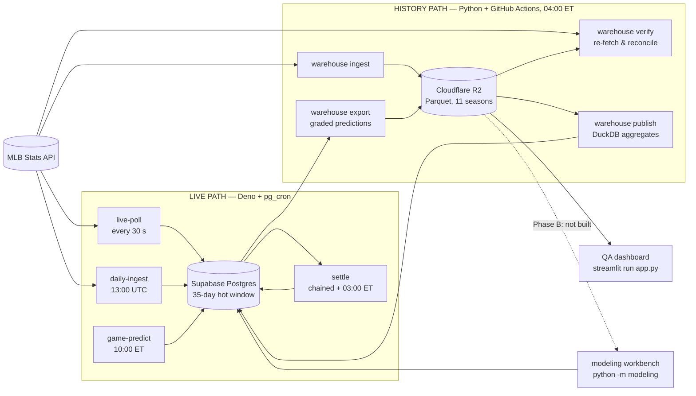

# Pitch Hawk — QA Runbook

**Audience:** anyone who needs to answer *"is the data and are the models OK
right now?"* without reading three design documents first.
**Scope:** one pass from collection → storage → QA dashboard → model review.
**Time:** ~10 minutes for the fast pass, ~30 with the deep dive.

This file tells you **what to run, what good looks like, and where to look when
it doesn't.** It does not explain *why* anything is built the way it is — for
that see [`DATA-PIPELINE.md`](DATA-PIPELINE.md) (design) and
[`DATA-OPERATIONS.md`](DATA-OPERATIONS.md) (current state, per-pipeline detail).
[`MODELS.md`](MODELS.md) is the model lifecycle runbook.

---

## 0. Setup, once

```bash
# Warehouse + dashboard need boto3, duckdb, pyarrow, python-dotenv.
py -m pip install -r requirements-warehouse.txt
py -m pip install -r requirements-modeling.txt
py -m pip install -r dashboard/requirements.txt
```

> **Use `py` (system Python 3.13), not `.venv`.** `.venv` holds only `pyarrow`,
> so `python -m warehouse` from inside it fails on `boto3`. Either use `py` or
> install `requirements-warehouse.txt` into the venv.

Credentials come from the repo-root `.env` — four variables, read by
`warehouse.config.r2_config()`:

```
R2_ACCOUNT_ID=          R2_ACCESS_KEY_ID=
R2_SECRET_ACCESS_KEY=   R2_BUCKET=pitch-hawk-warehouse
```

A wrong `R2_BUCKET` is the classic failure: R2 answers **403 on every object of
a bucket you cannot see**, so it historically read as *empty* rather than
*unreachable*. `R2Store` now head-buckets on startup and raises with the bucket
name, so you get a real error instead of a silent zero.

---

## 1. The fast pass — five commands

Run these in order. Each has a "good" and a "go look at §" column.

| # | Check | Command | Good looks like | If not |
|---|---|---|---|---|
| 1 | **Live serving** | `curl -s <supabase>/functions/v1/api/health` | `data_fresh: true`, five active models listed | §3 |
| 2 | **Job health, 48 h** | SQL below | every job with `failed = 0` | §3 |
| 3 | **Warehouse currency** | `py -m warehouse status` | newest day = yesterday; totals rising | §4 |
| 4 | **Data quality verdict** | `cd dashboard && streamlit run app.py` | verdict line green, no failing chips | §5 |
| 5 | **Model registry** | `py -m modeling status` | registry active version == what live scoring stamps | §6 |

Health endpoint:

```bash
curl -s https://gfxpchtyncgsczqdvohr.supabase.co/functions/v1/api/health
```

Job health (Supabase SQL editor, or MCP `execute_sql`):

```sql
select job,
       count(*) filter (where ok)     as ok,
       count(*) filter (where not ok) as failed,
       max(started_at)                as last_run
from ingest_runs
where started_at > now() - interval '48 hours'
group by 1 order by 1;
```

**⚠️ `/api/health` reports `"status":"ok"` while a job is failing.** It does not
read `ingest_runs`. Check 1 passing does not make check 2 redundant — this is a
known gap (`DATA-OPERATIONS.md` §8.2).

---

## 2. The system, so the checks make sense

Two independent readers of the same public MLB Stats API. They deliberately
disagree on some column semantics — that is by design, not a bug (see
`DATA-PIPELINE.md` §3.1).



**Four schedulers own different things.** Establishing which one owns a stopped
job is the first triage step:

| Scheduler | Owns | Where to look |
|---|---|---|
| **pg_cron** (inside Postgres) | `live-poll`, `settle`, `game-predict`, `daily-ingest`, cron-history prune | `select jobname, schedule, active from cron.job;` |
| **GitHub Actions** | warehouse nightly, CI, deploys | `gh run list --limit 30` |
| **Vercel** | frontend, on git push (no cron) | `vercel ls` |
| **Manual** | backfills, verify sweeps, training | your terminal |

**Trust `cron.job`, not the migrations.** Schedules were changed in production
after `20260703000002_cron.sql` and two jobs were unscheduled entirely.

---

## 3. Stage 1 — collection

### What you are checking

That both readers are still pulling, and that the live path is writing what the
scorer needs within its window.

### Commands

```sql
-- Is the scheduler even firing?
select jobname, schedule, active from cron.job order by jobname;

-- Why did a job fail? `detail` carries the error list and per-stage counts.
select id, started_at, ok, detail
from ingest_runs where job = 'daily-ingest' order by id desc limit 5;

-- Did the board have content before first pitch?
select * from prediction_coverage(current_date - 5, current_date)
order by official_date desc;
```

```bash
# Smoke-test the upstream feed itself, no database involved.
py scripts/verify_feeds.py
```

### What good looks like

- Five pg_cron jobs `active = true`. `np-odds-ingest` and `np-backfill`
  deliberately have **no** `cron.job` row — that is correct, not a gap.
- `ingest_runs` shows recent rows per job with `ok = true`.
- `prediction_coverage` non-zero for every recent date.

### Reading further

`DATA-OPERATIONS.md` §5 has one subsection per pipeline — trigger, cadence,
what it writes, and its failure mode. §4 is a 24-hour clock showing how the jobs
interleave, which is the fastest way to spot "this should have run by now".

---

## 4. Stage 2 — storage and independent verification

### The one distinction that matters

`_manifest.json` records two different claims per day, and confusing them is how
this project previously believed 2,011 days were verified when five were:

| Field | Written by | Means |
|---|---|---|
| `ingested_at` | `warehouse.ingest` | The ingest ran. Derived from the **same in-memory rows** as the Parquet, so it attests to nothing an independent re-derivation would catch. |
| `verified_at` / `verified_by` | `warehouse.verify` **only** | The day was re-fetched from the MLB API, re-derived from scratch, and matched. |

The hot-window prune gates its deletes on `verified_by`. An ingest-only entry
cannot satisfy it, however complete it looks.

### Commands

```bash
py -m warehouse status                 # manifest summary: days, rows, bytes, span, verified split
py -m warehouse pending                # days the nightly still owes
py -m warehouse pending --max-gap 14   # what the nightly itself uses

py -m warehouse verify --sample 20                  # spot check, writes nothing
py -m warehouse verify --day 2026-08-12 --record    # writes verified_by; earns the prune gate
py -m warehouse verify --range 2026-08-01..2026-08-12 --record

py -m warehouse --local ./tmp ingest --day 2026-08-12   # dry run, no R2, no credentials
```

`verify` re-fetches from the MLB API, so it is slow and rate-limit sensitive.
**Sample; do not sweep.**

### Exit codes are load-bearing

The nightly workflow and the prune gate both branch on them:

| Code | Means | Prune |
|---|---|---|
| `0` | every day passed | may proceed |
| `1` | a day failed — the warehouse disagrees with the MLB API | **must not run** |
| `2` | operational error (credentials, network, unreadable manifest) | **must not run** — we could not tell, which is not a pass |

### What verify actually catches

| Check | Catches |
|---|---|
| row count vs manifest | truncated or partial write |
| key checksum vs manifest | substituted or renumbered rows **at equal count** |
| Parquet read back from the store | bytes the manifest claims but the object never got |

The checksum is SHA-256 over the **sorted natural keys**
(`game_pk\|at_bat_index\|pitch_number`), so it is order-independent.

### Query R2 directly

Zero egress cost — reading the full 7.9 M-row corpus is free.

```sql
select pitch_type, count(*), avg(start_speed)
from read_parquet('s3://pitch-hawk-warehouse/pitches/season=2026/month=*/day=*.parquet')
where men_on_base = 'RISP' and times_through_order >= 3
group by 1 order by 2 desc;
```

DuckDB setup is six `set` statements — copy them from `R2Store.configure_duckdb`
or `DATA-PIPELINE.md` §6.5. **Never `list_objects`**: the scoped token has no
LIST permission, so `aws s3 ls` will tell you the bucket is empty. It is not.
Resolve files through the manifest, exactly as `warehouse/duck.py` does.

---

## 5. Stage 3 — the QA dashboard

```bash
pip install -r dashboard/requirements.txt
cd dashboard && streamlit run app.py
```

Read-only. It reads the bucket **in place** with DuckDB and copies nothing.

### How to read the page in 60 seconds

1. **Verdict strip** — one line, then a chip per check (icon + label + colour,
   never colour alone). Failing chips expand with the rows behind them. If this
   is green, stop; you are done.
2. **Freshness tiles** — time since last write, newest game day, median nightly
   lag, verification share, 30-file sparkline.
3. **Recent ingestion** — the last 14 day-files × 3 datasets with rows, expected,
   games, rows/game, deviation, bytes/row, lag, verification. **This is the table
   to read when something is flagged.**
4. **Volume / lag / cross-dataset** charts. Every chart has a table twin, so no
   value is reachable by colour alone.

Steps 1–4 cost **one 1.5 MB GET** and cover all history — they read only the
manifest. Only the **Deep dive** (sidebar dataset + window, 3 days by default)
scans Parquet.

### The checks, and what each one can see

| Check | Asks | Warn / fail |
|---|---|---|
| **Freshness** | Time since anything was written. The primary "did last night run?" signal. | 30 h / 48 h |
| **Coverage** | How far the newest *game date* trails today. | 3 d / 4 d (~2 d behind is the resting state) |
| **Volume** | Rows **per game** against the trailing baseline. | robust z, guarded |
| **Cross-dataset** | Do `pitches`, `at_bats`, `games` describe the same days the same way? Catches one dataset landing without its siblings — invisible from inside any single dataset. | missing dataset fails; 3.4–4.4 pitches/PA, 60–95 PA/game warn |
| **Ingest lag** | How long after the games the file appeared. | 3 d / 5 d |
| **File size** | Bytes per row — a schema change or all-null column, with no scan. | 15% floor, large files only |
| **Verification** | Have recent days been independently re-derived? | any of last 3 unverified warns |
| **Day gaps** | In-season calendar days with no file, last 14. | 1 d / 3 d |
| **Duplicate keys** | Rows in excess of distinct natural keys — a day written twice. | any fails |
| **Referential** | Pitches whose `game_pk` has no row in that day's `games` file. | any fails |
| **Null rates** | Which columns *moved*, in percentage points. The absolute rate is rarely the question — `on_third` is 91% null every day by design. | 1 pp / 5 pp; structural nulls exempt |
| **Value sanity** | Rules a valid feed cannot break, **scored by movement**. | first-time firing fails; usual rate reported as *known* |
| **Category sets** | Values that appeared or vanished — how a feed or flattener change announces itself. | any appearance warns |

### Why "normal" is defined the way it is

Every judgement is a **robust z against the trailing 28 days the warehouse
actually holds** — game days, not calendar days, excluding the day being judged:

```
z = 0.6745 × (x − median) / MAD
```

Median/MAD rather than mean/σ because a single broken day inflates σ enough to
hide itself. A day flags only when **both** `|z|` passes the threshold **and**
the move passes a relative floor. That pairing is the whole calibration story:
run naively, a bare robust-z rule marked **293 of 2,014 pitch-days as failing** —
essentially all of them healthy. Three guards bring it to ~1 warn per dataset in
14 days: a 5% relative floor, volume judged as rows **per game**, and a ≥ 3-game
minimum before volume is judged at all.

Thresholds live as one named constant per rule at the top of
`dashboard/utils/metrics.py` and `dashboard/utils/checks.py`, each with the
measurement that set it. **Change a threshold there, not in `app.py`.**

Test the judgement layer without credentials or network:

```bash
python -m pytest tests/dashboard -q
```

---

## 6. Stage 4 — model checking and review

### Three places model performance lives

| Where | Holds | How to read it |
|---|---|---|
| **`model_params`** | Production truth. Exactly one active row per market (partial unique index enforces it). | `py -m modeling list` / `show <market>` / `status` |
| **`model_runs`** | The experiment record — every run, **promoted or not**, with folds, config, holdout, params and the gate's verdict in `notes`. | Models dashboard, or query directly |
| **Models dashboard** | `dashboard/pages/2_Models.py` — what is live, what was tried, how it was chosen. | Same `streamlit run app.py`, then the Models page |

The Models page is **read-only by design**. Promotion goes through
`python -m modeling train --promote`, never a dashboard button — a UI that can
change what production serves is a UI that will, by accident.

### Commands

```bash
py -m modeling status                  # registry active version vs what live scoring stamps
py -m modeling list                    # every version, per market
py -m modeling show pitch_result       # active params as JSON
py -m modeling baseline                # score the live version for a comparable OOS number
```

`status` is the one to run habitually: it compares the registry's active version
against `predictions.model_version` — what live scoring **actually stamped** — so
a forgotten `live-poll` redeploy surfaces as a mismatch instead of a mystery.

Confirm from the database side:

```sql
select market, version, is_active, activated_at, metrics
from model_params order by market, activated_at desc nulls last;
```

`/api/health` also lists the active market/version pairs.

### How a version is judged

Read this before you believe any metric. The retired trainer gated on
**in-sample** training log-loss, which cannot see overfitting at all — a version
that memorised its training cells scored better and promoted. The gate now
compares **out-of-sample**:

- **Walk-forward, ten folds.** Fold N trains strictly on seasons `< N`; test
  seasons are 2016–2025.
- **2020 is reported per fold but excluded from the aggregate** — a 60-game COVID
  season distorts the mean by both sample size and schedule.
- **2026 is a frozen holdout** — never trained on, never selected on, scored once
  after the sweep has already picked a winner.
- Shipped coefficients are then refit on **every** season including 2026: the
  holdout validated the recipe, so the production fit should see all data.
- **Gate tolerance 2%** — promotes unless more than 2% worse than the active
  version on the market's primary metric.
- **Regression veto** — `linear` markets are held if out-of-sample σ-coverage
  leaves `[0.63, 0.73]`. A mis-scaled sigma has good RMSE and produces
  confidently wrong probabilities; RMSE alone cannot see it.

**There is no `--force`.** A held version is the gate working; overriding it is a
human decision that goes through an explicit `activate`.

### Training a candidate

```bash
py -m modeling build                          # R2 -> local cell cache (the only R2 command)
py -m modeling baseline                       # give the live version a comparable number first
py -m modeling sweep pitch_result             # walk-forward over every hyperparameter pair
py -m modeling train pitch_result             # sweep + holdout + record; production untouched
py -m modeling train pitch_result --promote   # + gate + activate
py -m modeling status                         # then watch
py -m modeling rollback pitch_result          # atomic undo if graded results disagree
```

`--promote` needs `SUPABASE_URL` and a **service_role** `SUPABASE_KEY`.

### Offline / production parity

`modeling/score.py` is a Python mirror of `supabase/functions/_shared/model.ts`,
pinned at `1e-9` by `tests/modeling/test_parity.py` against golden fixtures the
TypeScript itself emits. Without it, "validated offline" and "computed in
production" are two unverified claims.

```bash
# regenerate fixtures after any scoring change in model.ts
deno test --allow-write --allow-read supabase/functions/tests/scorer_golden_test.ts
```

**If Python and TypeScript disagree, the TypeScript is correct** — it is what
serves users.

Feature *baselines* live in `model.ts` (`pitcher_zone_delta` is
`zone_rate - 0.48`; `pitcher_k_delta` subtracts `LEAGUE.ab_result.strikeout`).
The cell SQL centres on those same constants rather than recomputing them from
the scan, because training and serving must centre a feature identically or the
shipped coefficients meet a differently scaled input. No parity test can catch
that — the scorer is handed the delta already computed — so it is pinned by
`tests/modeling/test_cells.py`.

### Adding a market or a family

- **New market** = one file in `modeling/specs/`, registered in
  `modeling/specs/__init__.py`. The engine never branches on market name;
  per-market differences go on `MarketSpec` (`family`, `bucket_step`,
  `bucket_col`, `bucket_baseline`, `datasets`). If adding a market requires
  editing `features.py`, `fit.py` or `validate.py` for anything other than a
  genuinely new *family*, the abstraction is wrong — say so rather than
  special-casing on market name.
- **New family** = scorer branch in `model.ts` → mirror in `modeling/score.py` →
  `FAMILIES` in `spec.py` → fitter in `fit.py::_FITTERS` → evaluator in
  `validate.py::_EVALUATORS` → redeploy `live-poll`. Both dispatch tables raise
  on an unknown family rather than defaulting.

---

## 7. Known and expected — do not chase these

Recorded so nobody spends an afternoon rediscovering them. Status as of the last
measured sweep (**2026-08-07**, `DATA-OPERATIONS.md`); re-measure with §1 before
treating any of it as current.

| Thing you will see | Why | Status |
|---|---|---|
| `pitches.outs` violates its own range on **~22% of rows, every day in the corpus** | `play.count.outs` is the count *after* the plate appearance, so mid-at-bat pitches carry the inning's final out count. `balls`/`strikes` are lagged in the flattener; `outs` is not. | **Real ingest bug.** Dashboard reports it as *known* rather than *failing today*. Fixing it means changing `warehouse/mlb.py` and re-ingesting. |
| `game_moneyline` shows an active version but never scores | `model.ts` has **no `params.type === "log5"` branch**. `game-predict` takes `log5HomeProb()`'s default `homeAdv = 0.542` and never reads `model_params`. Served moneyline is MLB's own `mlb_winprob_v1` feed. | By design for now. Models dashboard flags it 🚫. **Do not `--promote` it.** |
| Model registry frozen at `v1_20260707` | The weekly schedule was deliberately removed on 2026-08-02: the `train_*_cells` RPCs read all of `pitches`, and post-prune would have quietly returned 35 days and produced a worse model. `train_models.py` exits 2 with an explanation. | Re-pointing training at DuckDB over R2 is **Phase B — the last unbuilt piece.** |
| ~1,732 of ~2,018 R2 days are ingested-only | Phase 1 verified the delete set, not all of history. | Expected. Verification share on the dashboard reflects it. |
| `ab_result` served probabilities ≠ raw model output | `CALIB_SHRINK = 0.7` in `model.ts` shrinks toward the league prior. | Deliberate. |
| Historical `r2_cells = 0.9686` for `pitch_speed_ou` | R² against **cell means**, not per-pitch — how well a line fits ~900 pre-averaged points. The market ran ~47.3% live, below a coin flip. | The old metric never measured the live thing. Superseded by the walk-forward gate in §6. |
| `daily-ingest` failing, and the failure ratchets | See `DATA-OPERATIONS.md` §8.1. | 🔴 open as of 2026-08-07 — **verify current state before assuming.** |
| `/api/health` says `ok` while a job fails | It does not read `ingest_runs`. | 🔴 open. Always run check 2. |
| Nothing alerts on any failure | No alerting exists. | 🟠 open — this runbook is the alerting. |

---

## 8. Triage — symptom to source

| Symptom | First look | Then |
|---|---|---|
| Dashboard says stale / freshness fails | `gh run list --limit 30` — did the nightly run? | `gh run view <id>`; annotations explain infra failures |
| Dashboard cannot connect to R2 | `R2_BUCKET` in `.env` | R2 returns 403 not 404 on an invisible bucket; the store head-buckets at startup so this now reports as a connection failure |
| One dataset present, siblings missing | Cross-dataset check, expanded | `py -m warehouse pending`, then re-ingest the day |
| Volume flagged on a light schedule day | Rows-per-game column in **Recent ingestion**, not raw rows | A 4-game day at 1,150 pitches is a Monday, not a break |
| A column's nulls jumped | Column health in the Deep dive | A feed or flattener change; check `warehouse/config.py` schemas |
| Live board empty before first pitch | `prediction_coverage(...)` | `game-predict` detail in `DATA-OPERATIONS.md` §5.2 |
| Predictions stamped `heuristic_v0` | `py -m modeling status` | No active trained row, or `live-poll` not redeployed |
| Registry version ≠ stamped version | `py -m modeling status` | Redeploy `live-poll`; the mismatch is the whole point of the check |
| Offline and production numbers differ | `pytest tests/modeling/test_parity.py -q` | Regenerate golden fixtures from the TS; **the TS is correct** |

---

## 9. Test suites — what covers what

```bash
pytest tests/ -q                      # everything CI's backend job runs
python -m pytest tests/dashboard -q   # QA thresholds, no credentials or network
python -m pytest tests/warehouse -q   # flattener, manifest, ingest, verify
python -m pytest tests/modeling -q    # cells, fit, validate, TS parity
deno test --allow-net --allow-read --allow-env supabase/functions/tests/
```

Two tests exist specifically to stop a class of silent corruption and should
never be deleted without understanding them:

- **`tests/warehouse/test_mlb_flatten.py`** sets `matchup.splits.menOnBase` to a
  deliberately wrong value on every play, proving nothing reads it. That API
  field is the state **after** the play — used as a pre-pitch feature it encodes
  the at-bat's own outcome, and a model trained on it validates beautifully and
  is worthless live.
- **`tests/modeling/test_parity.py`** parses the real `switch` statement in
  `model.ts` and fails if Python and TypeScript scoring drift.

CI (`.github/workflows/ci.yml`) runs three jobs on push: `backend` (pytest),
`edge-functions` (Deno typecheck + tests), `migrations` (apply against a
throwaway database).

---

## 10. Invariants — breaking these is how data goes quietly wrong

| Invariant | Where | What breaks |
|---|---|---|
| **Explicit PyArrow schemas, always** | `warehouse/config.py:SCHEMAS` | An inferred schema types an all-NULL column as `null`; DuckDB then refuses to read that day alongside days where the column has values. **One bad day poisons a multi-season query.** |
| **A day is all-or-nothing** | `ingest.ingest_day` | A partial day is silently wrong forever, and its manifest entry claims it is complete. |
| **Only final games** | `mlb.schedule` | A suspended game frozen mid-way into history. |
| **Day writes are idempotent** | key scheme + `skip_existing` | Resumability — an interrupted backfill is resumed by re-running the window. |
| **Column lists frozen in `config.py`** | module docstring | A feed change must be a deliberate edit, never a silent layout change historical files no longer match. |
| **`HOT_WINDOW_DAYS = 35`** | `warehouse/config.py` | Both `refresh_*_rolling_stats` look back 30 days; 35 leaves 5 days of margin. Shrinking it breaks live scoring. |
| **Never read `matchup.splits.menOnBase`** | `mlb.men_on_base` | Target leakage. |
| **Never `list_objects`** | everywhere | The token has no LIST permission; you will conclude the bucket is empty. |

---

## 11. Where things live

```
docs/
  QA-RUNBOOK.md        <- you are here: what to run, what good looks like
  DATA-OPERATIONS.md   current state — schedules, health, capacity, runbooks
  DATA-PIPELINE.md     design — semantics, invariants, rationale (state frozen 2026-08-02)
  DATA-INVENTORY.md    product view of what we hold
  MODELS.md            model lifecycle runbook

warehouse/             history path: mlb.py (flattener) · config.py (schemas)
                       ingest.py · verify.py · manifest.py · duck.py
                       aggregates.py · publish.py · export.py · cli.py

dashboard/             QA dashboard: app.py (all rendering)
                       data/queries.py (every SQL statement, one place)
                       utils/metrics.py + utils/checks.py (thresholds live here)
                       pages/2_Models.py (model review)

modeling/              workbench: cli.py · features.py · fit.py · validate.py
                       score.py (mirror of model.ts) · runs.py · registry.py
                       specs/ (one file per market)

supabase/functions/    live path: _shared/mlb.ts (ingest) · _shared/model.ts (scorer)
                       live-poll · settle · game-predict · daily-ingest · api
```

**Where the two documents disagree:** `DATA-OPERATIONS.md` wins on *current
state*; `DATA-PIPELINE.md` wins on *why it is built that way*.
